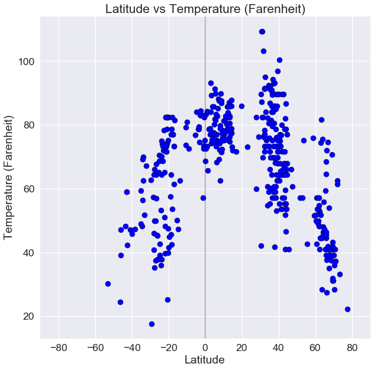
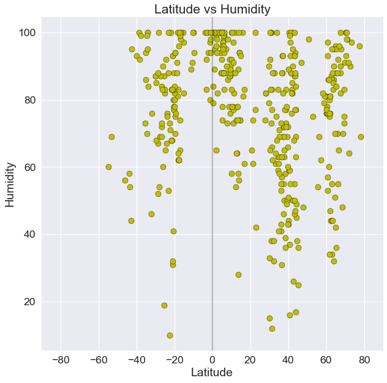
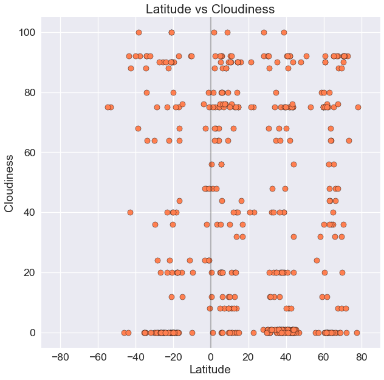
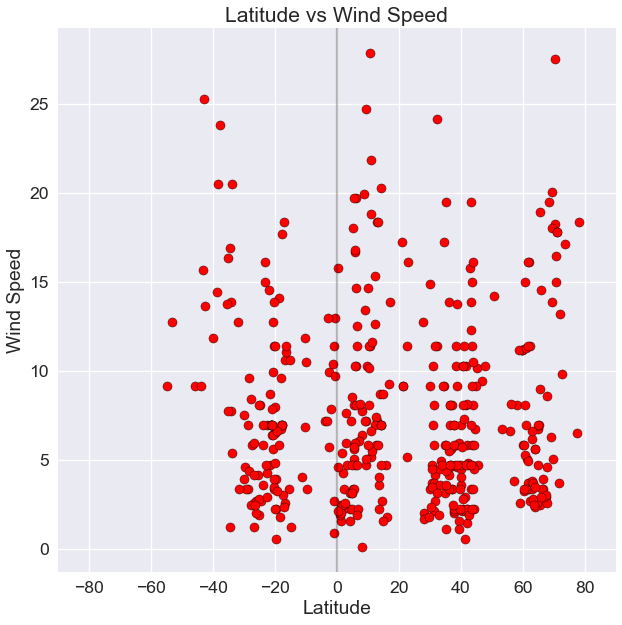

# Weather Analysis

### Observed trend 1: The closer to the equator a city is, the hotter the temperature would be, ranging from 70-95 degrees.

### Observed trend 2: Also around the equarter, humidity tends to be higher because of the hotter temperate.

### Observed trend 3: For cloudiness, there is no correlation based on latitude. Windspeed also seems to average around 5 MPH.


```python
from citipy import citipy
import numpy as np
import pandas as pd
import seaborn as sns
import json
import requests
import matplotlib.pyplot as plt
import random
import os
import csv
import datetime
import time
from config import api_key
from pprint import pprint
```


```python
# Create settings parameters
units = "imperial"
url = "http://api.openweathermap.org/data/2.5/weather?"
```


```python
# Getting a sample that is representative of the world cities.

# Set Lat & Lon Zones to randomly pick coordinates - So, we have some from each region.
lat_zone = np.arange(-90,90,15)
lon_zone = np.arange(-200,200,15)


# Creating a new data frame to hold randomly picked coordinates and corresponding city information
cities_df = pd.DataFrame()

cities_df["Latitude"] = ""
cities_df["Longitude"] = ""

# From each zone, randomly pick 50 unique coordinates and adding to the dataframe.
for x in lat_zone:
    for y in lon_zone:
        x_values = list(np.arange(x,x+15,0.01))
        y_values = list(np.arange(y,y+15,0.01))
        lats = random.sample(x_values,50)
        lons = random.sample(y_values,50)
        lat_samples = [(x+dec_lat) for dec_lat in lats]
        lon_samples = [y+dec_lon for dec_lon in lons]
        cities_df = cities_df.append(pd.DataFrame.from_dict({"Latitude":lat_samples,
                                       "Longitude":lon_samples}))
cities_df = cities_df.reset_index(drop=True)
cities_df.head(15)
```


<div>
<style scoped>
    .dataframe tbody tr th:only-of-type {
        vertical-align: middle;
    }

    .dataframe tbody tr th {
        vertical-align: top;
    }

    .dataframe thead th {
        text-align: right;
    }
</style>
<table border="1" class="dataframe">
  <thead>
    <tr style="text-align: right;">
      <th></th>
      <th>Latitude</th>
      <th>Longitude</th>
    </tr>
  </thead>
  <tbody>
    <tr>
      <th>0</th>
      <td>-173.07</td>
      <td>-388.42</td>
    </tr>
    <tr>
      <th>1</th>
      <td>-173.22</td>
      <td>-387.40</td>
    </tr>
    <tr>
      <th>2</th>
      <td>-167.35</td>
      <td>-386.47</td>
    </tr>
    <tr>
      <th>3</th>
      <td>-174.26</td>
      <td>-395.85</td>
    </tr>
    <tr>
      <th>4</th>
      <td>-168.05</td>
      <td>-396.02</td>
    </tr>
    <tr>
      <th>5</th>
      <td>-168.06</td>
      <td>-393.02</td>
    </tr>
    <tr>
      <th>6</th>
      <td>-166.57</td>
      <td>-396.27</td>
    </tr>
    <tr>
      <th>7</th>
      <td>-168.15</td>
      <td>-393.90</td>
    </tr>
    <tr>
      <th>8</th>
      <td>-174.75</td>
      <td>-388.17</td>
    </tr>
    <tr>
      <th>9</th>
      <td>-167.08</td>
      <td>-394.95</td>
    </tr>
    <tr>
      <th>10</th>
      <td>-165.38</td>
      <td>-387.34</td>
    </tr>
    <tr>
      <th>11</th>
      <td>-175.44</td>
      <td>-399.64</td>
    </tr>
    <tr>
      <th>12</th>
      <td>-172.85</td>
      <td>-394.94</td>
    </tr>
    <tr>
      <th>13</th>
      <td>-170.31</td>
      <td>-397.10</td>
    </tr>
    <tr>
      <th>14</th>
      <td>-168.36</td>
      <td>-389.52</td>
    </tr>
  </tbody>
</table>
</div>


```python
# For the selected coordinates, use citipy to associate them with nearest city.

cities_df["Closest City name"] = ""
cities_df["Closest Country code"] = ""
for index,row in cities_df.iterrows():
    city = citipy.nearest_city(row["Latitude"],row["Longitude"])
    cities_df.at[index,"Closest City name"]= city.city_name
    cities_df.at[index,"Closest Country code"] = city.country_code
```


```python
# Dropping random lat and lon samples from dataframe as they are not the exact coordinates for the cities.

clean_cities_df = cities_df.drop(['Latitude', 'Longitude'],axis=1)
clean_cities_df

# Dropping duplicate cities which may have resulted in the previous step
clean_cities_df = clean_cities_df.drop_duplicates()

clean_cities_df.head(15)
```


<div>
<style scoped>
    .dataframe tbody tr th:only-of-type {
        vertical-align: middle;
    }

    .dataframe tbody tr th {
        vertical-align: top;
    }

    .dataframe thead th {
        text-align: right;
    }
</style>
<table border="1" class="dataframe">
  <thead>
    <tr style="text-align: right;">
      <th></th>
      <th>Closest City name</th>
      <th>Closest Country code</th>
    </tr>
  </thead>
  <tbody>
    <tr>
      <th>0</th>
      <td>vaini</td>
      <td>to</td>
    </tr>
    <tr>
      <th>400</th>
      <td>punta arenas</td>
      <td>cl</td>
    </tr>
    <tr>
      <th>402</th>
      <td>mataura</td>
      <td>pf</td>
    </tr>
    <tr>
      <th>419</th>
      <td>ushuaia</td>
      <td>ar</td>
    </tr>
    <tr>
      <th>700</th>
      <td>bredasdorp</td>
      <td>za</td>
    </tr>
    <tr>
      <th>750</th>
      <td>port alfred</td>
      <td>za</td>
    </tr>
    <tr>
      <th>751</th>
      <td>port elizabeth</td>
      <td>za</td>
    </tr>
    <tr>
      <th>800</th>
      <td>albany</td>
      <td>au</td>
    </tr>
    <tr>
      <th>850</th>
      <td>hobart</td>
      <td>au</td>
    </tr>
    <tr>
      <th>900</th>
      <td>bluff</td>
      <td>nz</td>
    </tr>
    <tr>
      <th>1000</th>
      <td>kaitangata</td>
      <td>nz</td>
    </tr>
    <tr>
      <th>1100</th>
      <td>dunedin</td>
      <td>nz</td>
    </tr>
    <tr>
      <th>1150</th>
      <td>waipawa</td>
      <td>nz</td>
    </tr>
    <tr>
      <th>1200</th>
      <td>tolaga bay</td>
      <td>nz</td>
    </tr>
    <tr>
      <th>2000</th>
      <td>hermanus</td>
      <td>za</td>
    </tr>
  </tbody>
</table>
</div>


```python
# Picking a sample of 500 cities to proceed with analysis
selected_cities = clean_cities_df.sample(500)

selected_cities = selected_cities.reset_index(drop=True)
```

## Fetch City Weather Info from OpenWeatherAPI


```python
# Setting up values for OpenWeatherMap API calls
base_url = "http://api.openweathermap.org/data/2.5/weather"
app_id = api_key
params = { "appid" :app_id,"units":"imperial" }
```


```python
query_url = f"{base_url}appid={api_key}&units={units}&q="

counter = 0 + 1

for index,row in selected_cities.iterrows():
    params["q"] =f'{row["Closest City name"]},{row["Closest Country code"]}'
    print(f"Retrieving weather information for city #{counter} | {params['q']}")
    city_weather_resp = requests.get(base_url,params)
    print(city_weather_resp.url)
    city_weather_resp  = city_weather_resp.json()
    counter = counter + 1   
    selected_cities.set_value(index,"Latitude",city_weather_resp.get("coord",{}).get("lat"))
    selected_cities.set_value(index,"Longitude",city_weather_resp.get("coord",{}).get("lon"))
    selected_cities.set_value(index,"Date",city_weather_resp.get("dt"))
    selected_cities.set_value(index,"Temperature",city_weather_resp.get("main",{}).get("temp_max"))
    selected_cities.set_value(index,"Wind speed",city_weather_resp.get("wind",{}).get("speed"))
    selected_cities.set_value(index,"Humidity",city_weather_resp.get("main",{}).get("humidity"))
    selected_cities.set_value(index,"Cloudiness",city_weather_resp.get("clouds",{}).get("all"))
    
    
```

    Retrieving weather information for city #1 | provideniya,ru
    http://api.openweathermap.org/data/2.5/weather?appid=25bc90a1196e6f153eece0bc0b0fc9eb&units=imperial&q=provideniya%2Cru
    Retrieving weather information for city #2 | nantucket,us
    

    C:\Users\kryst\AppData\Local\Continuum\anaconda3\lib\site-packages\ipykernel_launcher.py:12: FutureWarning: set_value is deprecated and will be removed in a future release. Please use .at[] or .iat[] accessors instead
      if sys.path[0] == '':
    C:\Users\kryst\AppData\Local\Continuum\anaconda3\lib\site-packages\ipykernel_launcher.py:13: FutureWarning: set_value is deprecated and will be removed in a future release. Please use .at[] or .iat[] accessors instead
      del sys.path[0]
    C:\Users\kryst\AppData\Local\Continuum\anaconda3\lib\site-packages\ipykernel_launcher.py:14: FutureWarning: set_value is deprecated and will be removed in a future release. Please use .at[] or .iat[] accessors instead
      
    C:\Users\kryst\AppData\Local\Continuum\anaconda3\lib\site-packages\ipykernel_launcher.py:15: FutureWarning: set_value is deprecated and will be removed in a future release. Please use .at[] or .iat[] accessors instead
      from ipykernel import kernelapp as app
    C:\Users\kryst\AppData\Local\Continuum\anaconda3\lib\site-packages\ipykernel_launcher.py:16: FutureWarning: set_value is deprecated and will be removed in a future release. Please use .at[] or .iat[] accessors instead
      app.launch_new_instance()
    C:\Users\kryst\AppData\Local\Continuum\anaconda3\lib\site-packages\ipykernel_launcher.py:17: FutureWarning: set_value is deprecated and will be removed in a future release. Please use .at[] or .iat[] accessors instead
    C:\Users\kryst\AppData\Local\Continuum\anaconda3\lib\site-packages\ipykernel_launcher.py:18: FutureWarning: set_value is deprecated and will be removed in a future release. Please use .at[] or .iat[] accessors instead
    

    http://api.openweathermap.org/data/2.5/weather?appid=25bc90a1196e6f153eece0bc0b0fc9eb&units=imperial&q=nantucket%2Cus
    Retrieving weather information for city #3 | minudasht,ir
    http://api.openweathermap.org/data/2.5/weather?appid=25bc90a1196e6f153eece0bc0b0fc9eb&units=imperial&q=minudasht%2Cir
    Retrieving weather information for city #4 | north bend,us
    http://api.openweathermap.org/data/2.5/weather?appid=25bc90a1196e6f153eece0bc0b0fc9eb&units=imperial&q=north+bend%2Cus
    Retrieving weather information for city #5 | ghanzi,bw
    http://api.openweathermap.org/data/2.5/weather?appid=25bc90a1196e6f153eece0bc0b0fc9eb&units=imperial&q=ghanzi%2Cbw
    Retrieving weather information for city #6 | hofn,is
    http://api.openweathermap.org/data/2.5/weather?appid=25bc90a1196e6f153eece0bc0b0fc9eb&units=imperial&q=hofn%2Cis
    Retrieving weather information for city #7 | winnemucca,us
    http://api.openweathermap.org/data/2.5/weather?appid=25bc90a1196e6f153eece0bc0b0fc9eb&units=imperial&q=winnemucca%2Cus
    Retrieving weather information for city #8 | kishi,ng
    http://api.openweathermap.org/data/2.5/weather?appid=25bc90a1196e6f153eece0bc0b0fc9eb&units=imperial&q=kishi%2Cng
    Retrieving weather information for city #9 | chalus,ir
    http://api.openweathermap.org/data/2.5/weather?appid=25bc90a1196e6f153eece0bc0b0fc9eb&units=imperial&q=chalus%2Cir
    Retrieving weather information for city #10 | kutahya,tr
    http://api.openweathermap.org/data/2.5/weather?appid=25bc90a1196e6f153eece0bc0b0fc9eb&units=imperial&q=kutahya%2Ctr
    Retrieving weather information for city #11 | zabol,ir
    http://api.openweathermap.org/data/2.5/weather?appid=25bc90a1196e6f153eece0bc0b0fc9eb&units=imperial&q=zabol%2Cir
    Retrieving weather information for city #12 | abu zabad,sd
    http://api.openweathermap.org/data/2.5/weather?appid=25bc90a1196e6f153eece0bc0b0fc9eb&units=imperial&q=abu+zabad%2Csd
    Retrieving weather information for city #13 | victoria point,au
    http://api.openweathermap.org/data/2.5/weather?appid=25bc90a1196e6f153eece0bc0b0fc9eb&units=imperial&q=victoria+point%2Cau
    Retrieving weather information for city #14 | gambela,et
    http://api.openweathermap.org/data/2.5/weather?appid=25bc90a1196e6f153eece0bc0b0fc9eb&units=imperial&q=gambela%2Cet
    Retrieving weather information for city #15 | santander,es
    http://api.openweathermap.org/data/2.5/weather?appid=25bc90a1196e6f153eece0bc0b0fc9eb&units=imperial&q=santander%2Ces
    Retrieving weather information for city #16 | souillac,mu
    http://api.openweathermap.org/data/2.5/weather?appid=25bc90a1196e6f153eece0bc0b0fc9eb&units=imperial&q=souillac%2Cmu
    Retrieving weather information for city #17 | barentsburg,sj
    http://api.openweathermap.org/data/2.5/weather?appid=25bc90a1196e6f153eece0bc0b0fc9eb&units=imperial&q=barentsburg%2Csj
    Retrieving weather information for city #18 | mount isa,au
    http://api.openweathermap.org/data/2.5/weather?appid=25bc90a1196e6f153eece0bc0b0fc9eb&units=imperial&q=mount+isa%2Cau
    Retrieving weather information for city #19 | corumba,br
    http://api.openweathermap.org/data/2.5/weather?appid=25bc90a1196e6f153eece0bc0b0fc9eb&units=imperial&q=corumba%2Cbr
    Retrieving weather information for city #20 | husavik,is
    http://api.openweathermap.org/data/2.5/weather?appid=25bc90a1196e6f153eece0bc0b0fc9eb&units=imperial&q=husavik%2Cis
    Retrieving weather information for city #21 | babanusah,sd
    http://api.openweathermap.org/data/2.5/weather?appid=25bc90a1196e6f153eece0bc0b0fc9eb&units=imperial&q=babanusah%2Csd
    Retrieving weather information for city #22 | chokurdakh,ru
    http://api.openweathermap.org/data/2.5/weather?appid=25bc90a1196e6f153eece0bc0b0fc9eb&units=imperial&q=chokurdakh%2Cru
    Retrieving weather information for city #23 | tuy hoa,vn
    http://api.openweathermap.org/data/2.5/weather?appid=25bc90a1196e6f153eece0bc0b0fc9eb&units=imperial&q=tuy+hoa%2Cvn
    Retrieving weather information for city #24 | oum hadjer,td
    http://api.openweathermap.org/data/2.5/weather?appid=25bc90a1196e6f153eece0bc0b0fc9eb&units=imperial&q=oum+hadjer%2Ctd
    Retrieving weather information for city #25 | turukhansk,ru
    http://api.openweathermap.org/data/2.5/weather?appid=25bc90a1196e6f153eece0bc0b0fc9eb&units=imperial&q=turukhansk%2Cru
    Retrieving weather information for city #26 | vao,nc
    http://api.openweathermap.org/data/2.5/weather?appid=25bc90a1196e6f153eece0bc0b0fc9eb&units=imperial&q=vao%2Cnc
    Retrieving weather information for city #27 | mexico,us
    http://api.openweathermap.org/data/2.5/weather?appid=25bc90a1196e6f153eece0bc0b0fc9eb&units=imperial&q=mexico%2Cus
    Retrieving weather information for city #28 | middelburg,za
    http://api.openweathermap.org/data/2.5/weather?appid=25bc90a1196e6f153eece0bc0b0fc9eb&units=imperial&q=middelburg%2Cza
    Retrieving weather information for city #29 | labutta,mm
    http://api.openweathermap.org/data/2.5/weather?appid=25bc90a1196e6f153eece0bc0b0fc9eb&units=imperial&q=labutta%2Cmm
    Retrieving weather information for city #30 | puerto baquerizo moreno,ec
    http://api.openweathermap.org/data/2.5/weather?appid=25bc90a1196e6f153eece0bc0b0fc9eb&units=imperial&q=puerto+baquerizo+moreno%2Cec
    Retrieving weather information for city #31 | turtkul,uz
    http://api.openweathermap.org/data/2.5/weather?appid=25bc90a1196e6f153eece0bc0b0fc9eb&units=imperial&q=turtkul%2Cuz
    Retrieving weather information for city #32 | udachnyy,ru
    http://api.openweathermap.org/data/2.5/weather?appid=25bc90a1196e6f153eece0bc0b0fc9eb&units=imperial&q=udachnyy%2Cru
    Retrieving weather information for city #33 | cap malheureux,mu
    http://api.openweathermap.org/data/2.5/weather?appid=25bc90a1196e6f153eece0bc0b0fc9eb&units=imperial&q=cap+malheureux%2Cmu
    Retrieving weather information for city #34 | belyy yar,ru
    http://api.openweathermap.org/data/2.5/weather?appid=25bc90a1196e6f153eece0bc0b0fc9eb&units=imperial&q=belyy+yar%2Cru
    Retrieving weather information for city #35 | cullera,es
    http://api.openweathermap.org/data/2.5/weather?appid=25bc90a1196e6f153eece0bc0b0fc9eb&units=imperial&q=cullera%2Ces
    Retrieving weather information for city #36 | siilinjarvi,fi
    http://api.openweathermap.org/data/2.5/weather?appid=25bc90a1196e6f153eece0bc0b0fc9eb&units=imperial&q=siilinjarvi%2Cfi
    Retrieving weather information for city #37 | snezhnogorsk,ru
    http://api.openweathermap.org/data/2.5/weather?appid=25bc90a1196e6f153eece0bc0b0fc9eb&units=imperial&q=snezhnogorsk%2Cru
    Retrieving weather information for city #38 | qaanaaq,gl
    http://api.openweathermap.org/data/2.5/weather?appid=25bc90a1196e6f153eece0bc0b0fc9eb&units=imperial&q=qaanaaq%2Cgl
    Retrieving weather information for city #39 | kuusamo,fi
    http://api.openweathermap.org/data/2.5/weather?appid=25bc90a1196e6f153eece0bc0b0fc9eb&units=imperial&q=kuusamo%2Cfi
    Retrieving weather information for city #40 | ransang,ph
    http://api.openweathermap.org/data/2.5/weather?appid=25bc90a1196e6f153eece0bc0b0fc9eb&units=imperial&q=ransang%2Cph
    Retrieving weather information for city #41 | aykhal,ru
    http://api.openweathermap.org/data/2.5/weather?appid=25bc90a1196e6f153eece0bc0b0fc9eb&units=imperial&q=aykhal%2Cru
    Retrieving weather information for city #42 | hobyo,so
    http://api.openweathermap.org/data/2.5/weather?appid=25bc90a1196e6f153eece0bc0b0fc9eb&units=imperial&q=hobyo%2Cso
    Retrieving weather information for city #43 | kesennuma,jp
    http://api.openweathermap.org/data/2.5/weather?appid=25bc90a1196e6f153eece0bc0b0fc9eb&units=imperial&q=kesennuma%2Cjp
    Retrieving weather information for city #44 | karasjok,no
    http://api.openweathermap.org/data/2.5/weather?appid=25bc90a1196e6f153eece0bc0b0fc9eb&units=imperial&q=karasjok%2Cno
    Retrieving weather information for city #45 | pacific grove,us
    http://api.openweathermap.org/data/2.5/weather?appid=25bc90a1196e6f153eece0bc0b0fc9eb&units=imperial&q=pacific+grove%2Cus
    Retrieving weather information for city #46 | siparia,tt
    http://api.openweathermap.org/data/2.5/weather?appid=25bc90a1196e6f153eece0bc0b0fc9eb&units=imperial&q=siparia%2Ctt
    Retrieving weather information for city #47 | tir pol,af
    http://api.openweathermap.org/data/2.5/weather?appid=25bc90a1196e6f153eece0bc0b0fc9eb&units=imperial&q=tir+pol%2Caf
    Retrieving weather information for city #48 | bulawayo,zw
    http://api.openweathermap.org/data/2.5/weather?appid=25bc90a1196e6f153eece0bc0b0fc9eb&units=imperial&q=bulawayo%2Czw
    Retrieving weather information for city #49 | anar darreh,af
    http://api.openweathermap.org/data/2.5/weather?appid=25bc90a1196e6f153eece0bc0b0fc9eb&units=imperial&q=anar+darreh%2Caf
    Retrieving weather information for city #50 | roebourne,au
    http://api.openweathermap.org/data/2.5/weather?appid=25bc90a1196e6f153eece0bc0b0fc9eb&units=imperial&q=roebourne%2Cau
    Retrieving weather information for city #51 | bandarbeyla,so
    http://api.openweathermap.org/data/2.5/weather?appid=25bc90a1196e6f153eece0bc0b0fc9eb&units=imperial&q=bandarbeyla%2Cso
    Retrieving weather information for city #52 | gorontalo,id
    http://api.openweathermap.org/data/2.5/weather?appid=25bc90a1196e6f153eece0bc0b0fc9eb&units=imperial&q=gorontalo%2Cid
    Retrieving weather information for city #53 | ituni,gy
    http://api.openweathermap.org/data/2.5/weather?appid=25bc90a1196e6f153eece0bc0b0fc9eb&units=imperial&q=ituni%2Cgy
    Retrieving weather information for city #54 | kuche,cn
    http://api.openweathermap.org/data/2.5/weather?appid=25bc90a1196e6f153eece0bc0b0fc9eb&units=imperial&q=kuche%2Ccn
    Retrieving weather information for city #55 | port alfred,za
    http://api.openweathermap.org/data/2.5/weather?appid=25bc90a1196e6f153eece0bc0b0fc9eb&units=imperial&q=port+alfred%2Cza
    Retrieving weather information for city #56 | bintulu,my
    http://api.openweathermap.org/data/2.5/weather?appid=25bc90a1196e6f153eece0bc0b0fc9eb&units=imperial&q=bintulu%2Cmy
    Retrieving weather information for city #57 | guerrero negro,mx
    http://api.openweathermap.org/data/2.5/weather?appid=25bc90a1196e6f153eece0bc0b0fc9eb&units=imperial&q=guerrero+negro%2Cmx
    Retrieving weather information for city #58 | kombissiri,bf
    http://api.openweathermap.org/data/2.5/weather?appid=25bc90a1196e6f153eece0bc0b0fc9eb&units=imperial&q=kombissiri%2Cbf
    Retrieving weather information for city #59 | nizhneyansk,ru
    http://api.openweathermap.org/data/2.5/weather?appid=25bc90a1196e6f153eece0bc0b0fc9eb&units=imperial&q=nizhneyansk%2Cru
    Retrieving weather information for city #60 | viedma,ar
    http://api.openweathermap.org/data/2.5/weather?appid=25bc90a1196e6f153eece0bc0b0fc9eb&units=imperial&q=viedma%2Car
    Retrieving weather information for city #61 | talnakh,ru
    http://api.openweathermap.org/data/2.5/weather?appid=25bc90a1196e6f153eece0bc0b0fc9eb&units=imperial&q=talnakh%2Cru
    Retrieving weather information for city #62 | warwick,au
    http://api.openweathermap.org/data/2.5/weather?appid=25bc90a1196e6f153eece0bc0b0fc9eb&units=imperial&q=warwick%2Cau
    Retrieving weather information for city #63 | samarai,pg
    http://api.openweathermap.org/data/2.5/weather?appid=25bc90a1196e6f153eece0bc0b0fc9eb&units=imperial&q=samarai%2Cpg
    Retrieving weather information for city #64 | hithadhoo,mv
    http://api.openweathermap.org/data/2.5/weather?appid=25bc90a1196e6f153eece0bc0b0fc9eb&units=imperial&q=hithadhoo%2Cmv
    Retrieving weather information for city #65 | kerki,tm
    http://api.openweathermap.org/data/2.5/weather?appid=25bc90a1196e6f153eece0bc0b0fc9eb&units=imperial&q=kerki%2Ctm
    Retrieving weather information for city #66 | okhotsk,ru
    http://api.openweathermap.org/data/2.5/weather?appid=25bc90a1196e6f153eece0bc0b0fc9eb&units=imperial&q=okhotsk%2Cru
    Retrieving weather information for city #67 | boende,cd
    http://api.openweathermap.org/data/2.5/weather?appid=25bc90a1196e6f153eece0bc0b0fc9eb&units=imperial&q=boende%2Ccd
    Retrieving weather information for city #68 | hermanus,za
    http://api.openweathermap.org/data/2.5/weather?appid=25bc90a1196e6f153eece0bc0b0fc9eb&units=imperial&q=hermanus%2Cza
    Retrieving weather information for city #69 | coolum beach,au
    http://api.openweathermap.org/data/2.5/weather?appid=25bc90a1196e6f153eece0bc0b0fc9eb&units=imperial&q=coolum+beach%2Cau
    Retrieving weather information for city #70 | upata,ve
    http://api.openweathermap.org/data/2.5/weather?appid=25bc90a1196e6f153eece0bc0b0fc9eb&units=imperial&q=upata%2Cve
    Retrieving weather information for city #71 | acarau,br
    http://api.openweathermap.org/data/2.5/weather?appid=25bc90a1196e6f153eece0bc0b0fc9eb&units=imperial&q=acarau%2Cbr
    Retrieving weather information for city #72 | urumqi,cn
    http://api.openweathermap.org/data/2.5/weather?appid=25bc90a1196e6f153eece0bc0b0fc9eb&units=imperial&q=urumqi%2Ccn
    Retrieving weather information for city #73 | vaitupu,wf
    http://api.openweathermap.org/data/2.5/weather?appid=25bc90a1196e6f153eece0bc0b0fc9eb&units=imperial&q=vaitupu%2Cwf
    Retrieving weather information for city #74 | kalamazoo,us
    http://api.openweathermap.org/data/2.5/weather?appid=25bc90a1196e6f153eece0bc0b0fc9eb&units=imperial&q=kalamazoo%2Cus
    Retrieving weather information for city #75 | axim,gh
    http://api.openweathermap.org/data/2.5/weather?appid=25bc90a1196e6f153eece0bc0b0fc9eb&units=imperial&q=axim%2Cgh
    Retrieving weather information for city #76 | hami,cn
    http://api.openweathermap.org/data/2.5/weather?appid=25bc90a1196e6f153eece0bc0b0fc9eb&units=imperial&q=hami%2Ccn
    Retrieving weather information for city #77 | piacabucu,br
    http://api.openweathermap.org/data/2.5/weather?appid=25bc90a1196e6f153eece0bc0b0fc9eb&units=imperial&q=piacabucu%2Cbr
    Retrieving weather information for city #78 | dudinka,ru
    http://api.openweathermap.org/data/2.5/weather?appid=25bc90a1196e6f153eece0bc0b0fc9eb&units=imperial&q=dudinka%2Cru
    Retrieving weather information for city #79 | mitu,co
    http://api.openweathermap.org/data/2.5/weather?appid=25bc90a1196e6f153eece0bc0b0fc9eb&units=imperial&q=mitu%2Cco
    Retrieving weather information for city #80 | castro,cl
    http://api.openweathermap.org/data/2.5/weather?appid=25bc90a1196e6f153eece0bc0b0fc9eb&units=imperial&q=castro%2Ccl
    Retrieving weather information for city #81 | grocka,rs
    http://api.openweathermap.org/data/2.5/weather?appid=25bc90a1196e6f153eece0bc0b0fc9eb&units=imperial&q=grocka%2Crs
    Retrieving weather information for city #82 | xai-xai,mz
    http://api.openweathermap.org/data/2.5/weather?appid=25bc90a1196e6f153eece0bc0b0fc9eb&units=imperial&q=xai-xai%2Cmz
    Retrieving weather information for city #83 | vanimo,pg
    http://api.openweathermap.org/data/2.5/weather?appid=25bc90a1196e6f153eece0bc0b0fc9eb&units=imperial&q=vanimo%2Cpg
    Retrieving weather information for city #84 | tolaga bay,nz
    http://api.openweathermap.org/data/2.5/weather?appid=25bc90a1196e6f153eece0bc0b0fc9eb&units=imperial&q=tolaga+bay%2Cnz
    Retrieving weather information for city #85 | lloret de mar,es
    http://api.openweathermap.org/data/2.5/weather?appid=25bc90a1196e6f153eece0bc0b0fc9eb&units=imperial&q=lloret+de+mar%2Ces
    Retrieving weather information for city #86 | zhangjiakou,cn
    http://api.openweathermap.org/data/2.5/weather?appid=25bc90a1196e6f153eece0bc0b0fc9eb&units=imperial&q=zhangjiakou%2Ccn
    Retrieving weather information for city #87 | faanui,pf
    http://api.openweathermap.org/data/2.5/weather?appid=25bc90a1196e6f153eece0bc0b0fc9eb&units=imperial&q=faanui%2Cpf
    Retrieving weather information for city #88 | yuanping,cn
    http://api.openweathermap.org/data/2.5/weather?appid=25bc90a1196e6f153eece0bc0b0fc9eb&units=imperial&q=yuanping%2Ccn
    Retrieving weather information for city #89 | ciudad bolivar,ve
    http://api.openweathermap.org/data/2.5/weather?appid=25bc90a1196e6f153eece0bc0b0fc9eb&units=imperial&q=ciudad+bolivar%2Cve
    Retrieving weather information for city #90 | ascension,bo
    http://api.openweathermap.org/data/2.5/weather?appid=25bc90a1196e6f153eece0bc0b0fc9eb&units=imperial&q=ascension%2Cbo
    Retrieving weather information for city #91 | tumannyy,ru
    http://api.openweathermap.org/data/2.5/weather?appid=25bc90a1196e6f153eece0bc0b0fc9eb&units=imperial&q=tumannyy%2Cru
    Retrieving weather information for city #92 | brandon,us
    http://api.openweathermap.org/data/2.5/weather?appid=25bc90a1196e6f153eece0bc0b0fc9eb&units=imperial&q=brandon%2Cus
    Retrieving weather information for city #93 | bathsheba,bb
    http://api.openweathermap.org/data/2.5/weather?appid=25bc90a1196e6f153eece0bc0b0fc9eb&units=imperial&q=bathsheba%2Cbb
    Retrieving weather information for city #94 | gladstone,au
    http://api.openweathermap.org/data/2.5/weather?appid=25bc90a1196e6f153eece0bc0b0fc9eb&units=imperial&q=gladstone%2Cau
    Retrieving weather information for city #95 | harper,lr
    http://api.openweathermap.org/data/2.5/weather?appid=25bc90a1196e6f153eece0bc0b0fc9eb&units=imperial&q=harper%2Clr
    Retrieving weather information for city #96 | bouna,ci
    http://api.openweathermap.org/data/2.5/weather?appid=25bc90a1196e6f153eece0bc0b0fc9eb&units=imperial&q=bouna%2Cci
    Retrieving weather information for city #97 | mys shmidta,ru
    http://api.openweathermap.org/data/2.5/weather?appid=25bc90a1196e6f153eece0bc0b0fc9eb&units=imperial&q=mys+shmidta%2Cru
    Retrieving weather information for city #98 | leningradskiy,ru
    http://api.openweathermap.org/data/2.5/weather?appid=25bc90a1196e6f153eece0bc0b0fc9eb&units=imperial&q=leningradskiy%2Cru
    Retrieving weather information for city #99 | kendallville,us
    http://api.openweathermap.org/data/2.5/weather?appid=25bc90a1196e6f153eece0bc0b0fc9eb&units=imperial&q=kendallville%2Cus
    Retrieving weather information for city #100 | manuk mangkaw,ph
    http://api.openweathermap.org/data/2.5/weather?appid=25bc90a1196e6f153eece0bc0b0fc9eb&units=imperial&q=manuk+mangkaw%2Cph
    Retrieving weather information for city #101 | shakawe,bw
    http://api.openweathermap.org/data/2.5/weather?appid=25bc90a1196e6f153eece0bc0b0fc9eb&units=imperial&q=shakawe%2Cbw
    Retrieving weather information for city #102 | blackwater,au
    http://api.openweathermap.org/data/2.5/weather?appid=25bc90a1196e6f153eece0bc0b0fc9eb&units=imperial&q=blackwater%2Cau
    Retrieving weather information for city #103 | corinth,us
    http://api.openweathermap.org/data/2.5/weather?appid=25bc90a1196e6f153eece0bc0b0fc9eb&units=imperial&q=corinth%2Cus
    Retrieving weather information for city #104 | tongliao,cn
    http://api.openweathermap.org/data/2.5/weather?appid=25bc90a1196e6f153eece0bc0b0fc9eb&units=imperial&q=tongliao%2Ccn
    Retrieving weather information for city #105 | koutsouras,gr
    http://api.openweathermap.org/data/2.5/weather?appid=25bc90a1196e6f153eece0bc0b0fc9eb&units=imperial&q=koutsouras%2Cgr
    Retrieving weather information for city #106 | lethem,gy
    http://api.openweathermap.org/data/2.5/weather?appid=25bc90a1196e6f153eece0bc0b0fc9eb&units=imperial&q=lethem%2Cgy
    Retrieving weather information for city #107 | kadykchan,ru
    http://api.openweathermap.org/data/2.5/weather?appid=25bc90a1196e6f153eece0bc0b0fc9eb&units=imperial&q=kadykchan%2Cru
    Retrieving weather information for city #108 | kemijarvi,fi
    http://api.openweathermap.org/data/2.5/weather?appid=25bc90a1196e6f153eece0bc0b0fc9eb&units=imperial&q=kemijarvi%2Cfi
    Retrieving weather information for city #109 | taybad,ir
    http://api.openweathermap.org/data/2.5/weather?appid=25bc90a1196e6f153eece0bc0b0fc9eb&units=imperial&q=taybad%2Cir
    Retrieving weather information for city #110 | esperance,au
    http://api.openweathermap.org/data/2.5/weather?appid=25bc90a1196e6f153eece0bc0b0fc9eb&units=imperial&q=esperance%2Cau
    Retrieving weather information for city #111 | yarmouth,ca
    http://api.openweathermap.org/data/2.5/weather?appid=25bc90a1196e6f153eece0bc0b0fc9eb&units=imperial&q=yarmouth%2Cca
    Retrieving weather information for city #112 | christchurch,nz
    http://api.openweathermap.org/data/2.5/weather?appid=25bc90a1196e6f153eece0bc0b0fc9eb&units=imperial&q=christchurch%2Cnz
    Retrieving weather information for city #113 | say,ne
    http://api.openweathermap.org/data/2.5/weather?appid=25bc90a1196e6f153eece0bc0b0fc9eb&units=imperial&q=say%2Cne
    Retrieving weather information for city #114 | porto novo,cv
    http://api.openweathermap.org/data/2.5/weather?appid=25bc90a1196e6f153eece0bc0b0fc9eb&units=imperial&q=porto+novo%2Ccv
    Retrieving weather information for city #115 | vila velha,br
    http://api.openweathermap.org/data/2.5/weather?appid=25bc90a1196e6f153eece0bc0b0fc9eb&units=imperial&q=vila+velha%2Cbr
    Retrieving weather information for city #116 | pevek,ru
    http://api.openweathermap.org/data/2.5/weather?appid=25bc90a1196e6f153eece0bc0b0fc9eb&units=imperial&q=pevek%2Cru
    Retrieving weather information for city #117 | bengkulu,id
    http://api.openweathermap.org/data/2.5/weather?appid=25bc90a1196e6f153eece0bc0b0fc9eb&units=imperial&q=bengkulu%2Cid
    Retrieving weather information for city #118 | santa cruz,cr
    http://api.openweathermap.org/data/2.5/weather?appid=25bc90a1196e6f153eece0bc0b0fc9eb&units=imperial&q=santa+cruz%2Ccr
    Retrieving weather information for city #119 | bethel,us
    http://api.openweathermap.org/data/2.5/weather?appid=25bc90a1196e6f153eece0bc0b0fc9eb&units=imperial&q=bethel%2Cus
    Retrieving weather information for city #120 | kaeo,nz
    http://api.openweathermap.org/data/2.5/weather?appid=25bc90a1196e6f153eece0bc0b0fc9eb&units=imperial&q=kaeo%2Cnz
    Retrieving weather information for city #121 | joshimath,in
    http://api.openweathermap.org/data/2.5/weather?appid=25bc90a1196e6f153eece0bc0b0fc9eb&units=imperial&q=joshimath%2Cin
    Retrieving weather information for city #122 | palabuhanratu,id
    http://api.openweathermap.org/data/2.5/weather?appid=25bc90a1196e6f153eece0bc0b0fc9eb&units=imperial&q=palabuhanratu%2Cid
    Retrieving weather information for city #123 | tasiilaq,gl
    http://api.openweathermap.org/data/2.5/weather?appid=25bc90a1196e6f153eece0bc0b0fc9eb&units=imperial&q=tasiilaq%2Cgl
    Retrieving weather information for city #124 | toamasina,mg
    http://api.openweathermap.org/data/2.5/weather?appid=25bc90a1196e6f153eece0bc0b0fc9eb&units=imperial&q=toamasina%2Cmg
    Retrieving weather information for city #125 | kortkeros,ru
    http://api.openweathermap.org/data/2.5/weather?appid=25bc90a1196e6f153eece0bc0b0fc9eb&units=imperial&q=kortkeros%2Cru
    Retrieving weather information for city #126 | sabang,id
    http://api.openweathermap.org/data/2.5/weather?appid=25bc90a1196e6f153eece0bc0b0fc9eb&units=imperial&q=sabang%2Cid
    Retrieving weather information for city #127 | birjand,ir
    http://api.openweathermap.org/data/2.5/weather?appid=25bc90a1196e6f153eece0bc0b0fc9eb&units=imperial&q=birjand%2Cir
    Retrieving weather information for city #128 | collierville,us
    http://api.openweathermap.org/data/2.5/weather?appid=25bc90a1196e6f153eece0bc0b0fc9eb&units=imperial&q=collierville%2Cus
    Retrieving weather information for city #129 | puerto carreno,co
    http://api.openweathermap.org/data/2.5/weather?appid=25bc90a1196e6f153eece0bc0b0fc9eb&units=imperial&q=puerto+carreno%2Cco
    Retrieving weather information for city #130 | palmer,us
    http://api.openweathermap.org/data/2.5/weather?appid=25bc90a1196e6f153eece0bc0b0fc9eb&units=imperial&q=palmer%2Cus
    Retrieving weather information for city #131 | nieuw amsterdam,sr
    http://api.openweathermap.org/data/2.5/weather?appid=25bc90a1196e6f153eece0bc0b0fc9eb&units=imperial&q=nieuw+amsterdam%2Csr
    Retrieving weather information for city #132 | aketi,cd
    http://api.openweathermap.org/data/2.5/weather?appid=25bc90a1196e6f153eece0bc0b0fc9eb&units=imperial&q=aketi%2Ccd
    Retrieving weather information for city #133 | sao filipe,cv
    http://api.openweathermap.org/data/2.5/weather?appid=25bc90a1196e6f153eece0bc0b0fc9eb&units=imperial&q=sao+filipe%2Ccv
    Retrieving weather information for city #134 | calabozo,ve
    http://api.openweathermap.org/data/2.5/weather?appid=25bc90a1196e6f153eece0bc0b0fc9eb&units=imperial&q=calabozo%2Cve
    Retrieving weather information for city #135 | new ulm,us
    http://api.openweathermap.org/data/2.5/weather?appid=25bc90a1196e6f153eece0bc0b0fc9eb&units=imperial&q=new+ulm%2Cus
    Retrieving weather information for city #136 | sorkjosen,no
    http://api.openweathermap.org/data/2.5/weather?appid=25bc90a1196e6f153eece0bc0b0fc9eb&units=imperial&q=sorkjosen%2Cno
    Retrieving weather information for city #137 | cestas,fr
    http://api.openweathermap.org/data/2.5/weather?appid=25bc90a1196e6f153eece0bc0b0fc9eb&units=imperial&q=cestas%2Cfr
    Retrieving weather information for city #138 | sadovo,bg
    http://api.openweathermap.org/data/2.5/weather?appid=25bc90a1196e6f153eece0bc0b0fc9eb&units=imperial&q=sadovo%2Cbg
    Retrieving weather information for city #139 | chernyshevskiy,ru
    http://api.openweathermap.org/data/2.5/weather?appid=25bc90a1196e6f153eece0bc0b0fc9eb&units=imperial&q=chernyshevskiy%2Cru
    Retrieving weather information for city #140 | maragogi,br
    http://api.openweathermap.org/data/2.5/weather?appid=25bc90a1196e6f153eece0bc0b0fc9eb&units=imperial&q=maragogi%2Cbr
    Retrieving weather information for city #141 | monaragala,lk
    http://api.openweathermap.org/data/2.5/weather?appid=25bc90a1196e6f153eece0bc0b0fc9eb&units=imperial&q=monaragala%2Clk
    Retrieving weather information for city #142 | saint-philippe,re
    http://api.openweathermap.org/data/2.5/weather?appid=25bc90a1196e6f153eece0bc0b0fc9eb&units=imperial&q=saint-philippe%2Cre
    Retrieving weather information for city #143 | lardos,gr
    http://api.openweathermap.org/data/2.5/weather?appid=25bc90a1196e6f153eece0bc0b0fc9eb&units=imperial&q=lardos%2Cgr
    Retrieving weather information for city #144 | chateaubelair,vc
    http://api.openweathermap.org/data/2.5/weather?appid=25bc90a1196e6f153eece0bc0b0fc9eb&units=imperial&q=chateaubelair%2Cvc
    Retrieving weather information for city #145 | grafton,au
    http://api.openweathermap.org/data/2.5/weather?appid=25bc90a1196e6f153eece0bc0b0fc9eb&units=imperial&q=grafton%2Cau
    Retrieving weather information for city #146 | marabba,sd
    http://api.openweathermap.org/data/2.5/weather?appid=25bc90a1196e6f153eece0bc0b0fc9eb&units=imperial&q=marabba%2Csd
    Retrieving weather information for city #147 | columbus,us
    http://api.openweathermap.org/data/2.5/weather?appid=25bc90a1196e6f153eece0bc0b0fc9eb&units=imperial&q=columbus%2Cus
    Retrieving weather information for city #148 | pesochnyy,ru
    http://api.openweathermap.org/data/2.5/weather?appid=25bc90a1196e6f153eece0bc0b0fc9eb&units=imperial&q=pesochnyy%2Cru
    Retrieving weather information for city #149 | hendek,tr
    http://api.openweathermap.org/data/2.5/weather?appid=25bc90a1196e6f153eece0bc0b0fc9eb&units=imperial&q=hendek%2Ctr
    Retrieving weather information for city #150 | veliki preslav,bg
    http://api.openweathermap.org/data/2.5/weather?appid=25bc90a1196e6f153eece0bc0b0fc9eb&units=imperial&q=veliki+preslav%2Cbg
    Retrieving weather information for city #151 | karratha,au
    http://api.openweathermap.org/data/2.5/weather?appid=25bc90a1196e6f153eece0bc0b0fc9eb&units=imperial&q=karratha%2Cau
    Retrieving weather information for city #152 | redmond,us
    http://api.openweathermap.org/data/2.5/weather?appid=25bc90a1196e6f153eece0bc0b0fc9eb&units=imperial&q=redmond%2Cus
    Retrieving weather information for city #153 | henties bay,na
    http://api.openweathermap.org/data/2.5/weather?appid=25bc90a1196e6f153eece0bc0b0fc9eb&units=imperial&q=henties+bay%2Cna
    Retrieving weather information for city #154 | mabaruma,gy
    http://api.openweathermap.org/data/2.5/weather?appid=25bc90a1196e6f153eece0bc0b0fc9eb&units=imperial&q=mabaruma%2Cgy
    Retrieving weather information for city #155 | ondarroa,es
    http://api.openweathermap.org/data/2.5/weather?appid=25bc90a1196e6f153eece0bc0b0fc9eb&units=imperial&q=ondarroa%2Ces
    Retrieving weather information for city #156 | boa vista,br
    http://api.openweathermap.org/data/2.5/weather?appid=25bc90a1196e6f153eece0bc0b0fc9eb&units=imperial&q=boa+vista%2Cbr
    Retrieving weather information for city #157 | maxixe,mz
    http://api.openweathermap.org/data/2.5/weather?appid=25bc90a1196e6f153eece0bc0b0fc9eb&units=imperial&q=maxixe%2Cmz
    Retrieving weather information for city #158 | eugene,us
    http://api.openweathermap.org/data/2.5/weather?appid=25bc90a1196e6f153eece0bc0b0fc9eb&units=imperial&q=eugene%2Cus
    Retrieving weather information for city #159 | nha trang,vn
    http://api.openweathermap.org/data/2.5/weather?appid=25bc90a1196e6f153eece0bc0b0fc9eb&units=imperial&q=nha+trang%2Cvn
    Retrieving weather information for city #160 | dukat,ru
    http://api.openweathermap.org/data/2.5/weather?appid=25bc90a1196e6f153eece0bc0b0fc9eb&units=imperial&q=dukat%2Cru
    Retrieving weather information for city #161 | nurota,uz
    http://api.openweathermap.org/data/2.5/weather?appid=25bc90a1196e6f153eece0bc0b0fc9eb&units=imperial&q=nurota%2Cuz
    Retrieving weather information for city #162 | terre haute,us
    http://api.openweathermap.org/data/2.5/weather?appid=25bc90a1196e6f153eece0bc0b0fc9eb&units=imperial&q=terre+haute%2Cus
    Retrieving weather information for city #163 | zhigansk,ru
    http://api.openweathermap.org/data/2.5/weather?appid=25bc90a1196e6f153eece0bc0b0fc9eb&units=imperial&q=zhigansk%2Cru
    Retrieving weather information for city #164 | mehamn,no
    http://api.openweathermap.org/data/2.5/weather?appid=25bc90a1196e6f153eece0bc0b0fc9eb&units=imperial&q=mehamn%2Cno
    Retrieving weather information for city #165 | sokolo,ml
    http://api.openweathermap.org/data/2.5/weather?appid=25bc90a1196e6f153eece0bc0b0fc9eb&units=imperial&q=sokolo%2Cml
    Retrieving weather information for city #166 | new norfolk,au
    http://api.openweathermap.org/data/2.5/weather?appid=25bc90a1196e6f153eece0bc0b0fc9eb&units=imperial&q=new+norfolk%2Cau
    Retrieving weather information for city #167 | wenchi,gh
    http://api.openweathermap.org/data/2.5/weather?appid=25bc90a1196e6f153eece0bc0b0fc9eb&units=imperial&q=wenchi%2Cgh
    Retrieving weather information for city #168 | klaksvik,fo
    http://api.openweathermap.org/data/2.5/weather?appid=25bc90a1196e6f153eece0bc0b0fc9eb&units=imperial&q=klaksvik%2Cfo
    Retrieving weather information for city #169 | tarakan,id
    http://api.openweathermap.org/data/2.5/weather?appid=25bc90a1196e6f153eece0bc0b0fc9eb&units=imperial&q=tarakan%2Cid
    Retrieving weather information for city #170 | serik,tr
    http://api.openweathermap.org/data/2.5/weather?appid=25bc90a1196e6f153eece0bc0b0fc9eb&units=imperial&q=serik%2Ctr
    Retrieving weather information for city #171 | paracuru,br
    http://api.openweathermap.org/data/2.5/weather?appid=25bc90a1196e6f153eece0bc0b0fc9eb&units=imperial&q=paracuru%2Cbr
    Retrieving weather information for city #172 | birao,cf
    http://api.openweathermap.org/data/2.5/weather?appid=25bc90a1196e6f153eece0bc0b0fc9eb&units=imperial&q=birao%2Ccf
    Retrieving weather information for city #173 | dalian,cn
    http://api.openweathermap.org/data/2.5/weather?appid=25bc90a1196e6f153eece0bc0b0fc9eb&units=imperial&q=dalian%2Ccn
    Retrieving weather information for city #174 | lulea,se
    http://api.openweathermap.org/data/2.5/weather?appid=25bc90a1196e6f153eece0bc0b0fc9eb&units=imperial&q=lulea%2Cse
    Retrieving weather information for city #175 | illoqqortoormiut,gl
    http://api.openweathermap.org/data/2.5/weather?appid=25bc90a1196e6f153eece0bc0b0fc9eb&units=imperial&q=illoqqortoormiut%2Cgl
    Retrieving weather information for city #176 | nicoya,cr
    http://api.openweathermap.org/data/2.5/weather?appid=25bc90a1196e6f153eece0bc0b0fc9eb&units=imperial&q=nicoya%2Ccr
    Retrieving weather information for city #177 | linfen,cn
    http://api.openweathermap.org/data/2.5/weather?appid=25bc90a1196e6f153eece0bc0b0fc9eb&units=imperial&q=linfen%2Ccn
    Retrieving weather information for city #178 | garmsar,ir
    http://api.openweathermap.org/data/2.5/weather?appid=25bc90a1196e6f153eece0bc0b0fc9eb&units=imperial&q=garmsar%2Cir
    Retrieving weather information for city #179 | xihe,cn
    http://api.openweathermap.org/data/2.5/weather?appid=25bc90a1196e6f153eece0bc0b0fc9eb&units=imperial&q=xihe%2Ccn
    Retrieving weather information for city #180 | kuytun,cn
    http://api.openweathermap.org/data/2.5/weather?appid=25bc90a1196e6f153eece0bc0b0fc9eb&units=imperial&q=kuytun%2Ccn
    Retrieving weather information for city #181 | aubenas,fr
    http://api.openweathermap.org/data/2.5/weather?appid=25bc90a1196e6f153eece0bc0b0fc9eb&units=imperial&q=aubenas%2Cfr
    Retrieving weather information for city #182 | osias,ph
    http://api.openweathermap.org/data/2.5/weather?appid=25bc90a1196e6f153eece0bc0b0fc9eb&units=imperial&q=osias%2Cph
    Retrieving weather information for city #183 | lorengau,pg
    http://api.openweathermap.org/data/2.5/weather?appid=25bc90a1196e6f153eece0bc0b0fc9eb&units=imperial&q=lorengau%2Cpg
    Retrieving weather information for city #184 | phan rang,vn
    http://api.openweathermap.org/data/2.5/weather?appid=25bc90a1196e6f153eece0bc0b0fc9eb&units=imperial&q=phan+rang%2Cvn
    Retrieving weather information for city #185 | banda aceh,id
    http://api.openweathermap.org/data/2.5/weather?appid=25bc90a1196e6f153eece0bc0b0fc9eb&units=imperial&q=banda+aceh%2Cid
    Retrieving weather information for city #186 | foz,es
    http://api.openweathermap.org/data/2.5/weather?appid=25bc90a1196e6f153eece0bc0b0fc9eb&units=imperial&q=foz%2Ces
    Retrieving weather information for city #187 | sarkikaraagac,tr
    http://api.openweathermap.org/data/2.5/weather?appid=25bc90a1196e6f153eece0bc0b0fc9eb&units=imperial&q=sarkikaraagac%2Ctr
    Retrieving weather information for city #188 | warqla,dz
    http://api.openweathermap.org/data/2.5/weather?appid=25bc90a1196e6f153eece0bc0b0fc9eb&units=imperial&q=warqla%2Cdz
    Retrieving weather information for city #189 | kavieng,pg
    http://api.openweathermap.org/data/2.5/weather?appid=25bc90a1196e6f153eece0bc0b0fc9eb&units=imperial&q=kavieng%2Cpg
    Retrieving weather information for city #190 | port-de-bouc,fr
    http://api.openweathermap.org/data/2.5/weather?appid=25bc90a1196e6f153eece0bc0b0fc9eb&units=imperial&q=port-de-bouc%2Cfr
    Retrieving weather information for city #191 | liangxiang,cn
    http://api.openweathermap.org/data/2.5/weather?appid=25bc90a1196e6f153eece0bc0b0fc9eb&units=imperial&q=liangxiang%2Ccn
    Retrieving weather information for city #192 | mahebourg,mu
    http://api.openweathermap.org/data/2.5/weather?appid=25bc90a1196e6f153eece0bc0b0fc9eb&units=imperial&q=mahebourg%2Cmu
    Retrieving weather information for city #193 | brewster,us
    http://api.openweathermap.org/data/2.5/weather?appid=25bc90a1196e6f153eece0bc0b0fc9eb&units=imperial&q=brewster%2Cus
    Retrieving weather information for city #194 | trairi,br
    http://api.openweathermap.org/data/2.5/weather?appid=25bc90a1196e6f153eece0bc0b0fc9eb&units=imperial&q=trairi%2Cbr
    Retrieving weather information for city #195 | caravelas,br
    http://api.openweathermap.org/data/2.5/weather?appid=25bc90a1196e6f153eece0bc0b0fc9eb&units=imperial&q=caravelas%2Cbr
    Retrieving weather information for city #196 | juegang,cn
    http://api.openweathermap.org/data/2.5/weather?appid=25bc90a1196e6f153eece0bc0b0fc9eb&units=imperial&q=juegang%2Ccn
    Retrieving weather information for city #197 | hasaki,jp
    http://api.openweathermap.org/data/2.5/weather?appid=25bc90a1196e6f153eece0bc0b0fc9eb&units=imperial&q=hasaki%2Cjp
    Retrieving weather information for city #198 | bafq,ir
    http://api.openweathermap.org/data/2.5/weather?appid=25bc90a1196e6f153eece0bc0b0fc9eb&units=imperial&q=bafq%2Cir
    Retrieving weather information for city #199 | brae,gb
    http://api.openweathermap.org/data/2.5/weather?appid=25bc90a1196e6f153eece0bc0b0fc9eb&units=imperial&q=brae%2Cgb
    Retrieving weather information for city #200 | ugoofaaru,mv
    http://api.openweathermap.org/data/2.5/weather?appid=25bc90a1196e6f153eece0bc0b0fc9eb&units=imperial&q=ugoofaaru%2Cmv
    Retrieving weather information for city #201 | fengrun,cn
    http://api.openweathermap.org/data/2.5/weather?appid=25bc90a1196e6f153eece0bc0b0fc9eb&units=imperial&q=fengrun%2Ccn
    Retrieving weather information for city #202 | pahrump,us
    http://api.openweathermap.org/data/2.5/weather?appid=25bc90a1196e6f153eece0bc0b0fc9eb&units=imperial&q=pahrump%2Cus
    Retrieving weather information for city #203 | naryan-mar,ru
    http://api.openweathermap.org/data/2.5/weather?appid=25bc90a1196e6f153eece0bc0b0fc9eb&units=imperial&q=naryan-mar%2Cru
    Retrieving weather information for city #204 | kamarion,gr
    http://api.openweathermap.org/data/2.5/weather?appid=25bc90a1196e6f153eece0bc0b0fc9eb&units=imperial&q=kamarion%2Cgr
    Retrieving weather information for city #205 | teruel,es
    http://api.openweathermap.org/data/2.5/weather?appid=25bc90a1196e6f153eece0bc0b0fc9eb&units=imperial&q=teruel%2Ces
    Retrieving weather information for city #206 | san cristobal,ec
    http://api.openweathermap.org/data/2.5/weather?appid=25bc90a1196e6f153eece0bc0b0fc9eb&units=imperial&q=san+cristobal%2Cec
    Retrieving weather information for city #207 | cape town,za
    http://api.openweathermap.org/data/2.5/weather?appid=25bc90a1196e6f153eece0bc0b0fc9eb&units=imperial&q=cape+town%2Cza
    Retrieving weather information for city #208 | emerald,au
    http://api.openweathermap.org/data/2.5/weather?appid=25bc90a1196e6f153eece0bc0b0fc9eb&units=imperial&q=emerald%2Cau
    Retrieving weather information for city #209 | zakharo,gr
    http://api.openweathermap.org/data/2.5/weather?appid=25bc90a1196e6f153eece0bc0b0fc9eb&units=imperial&q=zakharo%2Cgr
    Retrieving weather information for city #210 | dasoguz,tm
    http://api.openweathermap.org/data/2.5/weather?appid=25bc90a1196e6f153eece0bc0b0fc9eb&units=imperial&q=dasoguz%2Ctm
    Retrieving weather information for city #211 | tazovskiy,ru
    http://api.openweathermap.org/data/2.5/weather?appid=25bc90a1196e6f153eece0bc0b0fc9eb&units=imperial&q=tazovskiy%2Cru
    Retrieving weather information for city #212 | rusape,zw
    http://api.openweathermap.org/data/2.5/weather?appid=25bc90a1196e6f153eece0bc0b0fc9eb&units=imperial&q=rusape%2Czw
    Retrieving weather information for city #213 | loa janan,id
    http://api.openweathermap.org/data/2.5/weather?appid=25bc90a1196e6f153eece0bc0b0fc9eb&units=imperial&q=loa+janan%2Cid
    Retrieving weather information for city #214 | butaritari,ki
    http://api.openweathermap.org/data/2.5/weather?appid=25bc90a1196e6f153eece0bc0b0fc9eb&units=imperial&q=butaritari%2Cki
    Retrieving weather information for city #215 | artyk,ru
    http://api.openweathermap.org/data/2.5/weather?appid=25bc90a1196e6f153eece0bc0b0fc9eb&units=imperial&q=artyk%2Cru
    Retrieving weather information for city #216 | halalo,wf
    http://api.openweathermap.org/data/2.5/weather?appid=25bc90a1196e6f153eece0bc0b0fc9eb&units=imperial&q=halalo%2Cwf
    Retrieving weather information for city #217 | iisalmi,fi
    http://api.openweathermap.org/data/2.5/weather?appid=25bc90a1196e6f153eece0bc0b0fc9eb&units=imperial&q=iisalmi%2Cfi
    Retrieving weather information for city #218 | saint george,bm
    http://api.openweathermap.org/data/2.5/weather?appid=25bc90a1196e6f153eece0bc0b0fc9eb&units=imperial&q=saint+george%2Cbm
    Retrieving weather information for city #219 | algeciras,ph
    http://api.openweathermap.org/data/2.5/weather?appid=25bc90a1196e6f153eece0bc0b0fc9eb&units=imperial&q=algeciras%2Cph
    Retrieving weather information for city #220 | zhifang,cn
    http://api.openweathermap.org/data/2.5/weather?appid=25bc90a1196e6f153eece0bc0b0fc9eb&units=imperial&q=zhifang%2Ccn
    Retrieving weather information for city #221 | shelburne,ca
    http://api.openweathermap.org/data/2.5/weather?appid=25bc90a1196e6f153eece0bc0b0fc9eb&units=imperial&q=shelburne%2Cca
    Retrieving weather information for city #222 | tabiauea,ki
    http://api.openweathermap.org/data/2.5/weather?appid=25bc90a1196e6f153eece0bc0b0fc9eb&units=imperial&q=tabiauea%2Cki
    Retrieving weather information for city #223 | sidi ali,dz
    http://api.openweathermap.org/data/2.5/weather?appid=25bc90a1196e6f153eece0bc0b0fc9eb&units=imperial&q=sidi+ali%2Cdz
    Retrieving weather information for city #224 | arica,cl
    http://api.openweathermap.org/data/2.5/weather?appid=25bc90a1196e6f153eece0bc0b0fc9eb&units=imperial&q=arica%2Ccl
    Retrieving weather information for city #225 | sterling,us
    http://api.openweathermap.org/data/2.5/weather?appid=25bc90a1196e6f153eece0bc0b0fc9eb&units=imperial&q=sterling%2Cus
    Retrieving weather information for city #226 | datong,cn
    http://api.openweathermap.org/data/2.5/weather?appid=25bc90a1196e6f153eece0bc0b0fc9eb&units=imperial&q=datong%2Ccn
    Retrieving weather information for city #227 | hoopstad,za
    http://api.openweathermap.org/data/2.5/weather?appid=25bc90a1196e6f153eece0bc0b0fc9eb&units=imperial&q=hoopstad%2Cza
    Retrieving weather information for city #228 | barrow,us
    http://api.openweathermap.org/data/2.5/weather?appid=25bc90a1196e6f153eece0bc0b0fc9eb&units=imperial&q=barrow%2Cus
    Retrieving weather information for city #229 | paducah,us
    http://api.openweathermap.org/data/2.5/weather?appid=25bc90a1196e6f153eece0bc0b0fc9eb&units=imperial&q=paducah%2Cus
    Retrieving weather information for city #230 | ust-tsilma,ru
    http://api.openweathermap.org/data/2.5/weather?appid=25bc90a1196e6f153eece0bc0b0fc9eb&units=imperial&q=ust-tsilma%2Cru
    Retrieving weather information for city #231 | waipawa,nz
    http://api.openweathermap.org/data/2.5/weather?appid=25bc90a1196e6f153eece0bc0b0fc9eb&units=imperial&q=waipawa%2Cnz
    Retrieving weather information for city #232 | bud,no
    http://api.openweathermap.org/data/2.5/weather?appid=25bc90a1196e6f153eece0bc0b0fc9eb&units=imperial&q=bud%2Cno
    Retrieving weather information for city #233 | svetlogorsk,ru
    http://api.openweathermap.org/data/2.5/weather?appid=25bc90a1196e6f153eece0bc0b0fc9eb&units=imperial&q=svetlogorsk%2Cru
    Retrieving weather information for city #234 | cotonou,bj
    http://api.openweathermap.org/data/2.5/weather?appid=25bc90a1196e6f153eece0bc0b0fc9eb&units=imperial&q=cotonou%2Cbj
    Retrieving weather information for city #235 | kaoma,zm
    http://api.openweathermap.org/data/2.5/weather?appid=25bc90a1196e6f153eece0bc0b0fc9eb&units=imperial&q=kaoma%2Czm
    Retrieving weather information for city #236 | bardiyah,ly
    http://api.openweathermap.org/data/2.5/weather?appid=25bc90a1196e6f153eece0bc0b0fc9eb&units=imperial&q=bardiyah%2Cly
    Retrieving weather information for city #237 | lasa,cn
    http://api.openweathermap.org/data/2.5/weather?appid=25bc90a1196e6f153eece0bc0b0fc9eb&units=imperial&q=lasa%2Ccn
    Retrieving weather information for city #238 | kolimvari,gr
    http://api.openweathermap.org/data/2.5/weather?appid=25bc90a1196e6f153eece0bc0b0fc9eb&units=imperial&q=kolimvari%2Cgr
    Retrieving weather information for city #239 | matara,lk
    http://api.openweathermap.org/data/2.5/weather?appid=25bc90a1196e6f153eece0bc0b0fc9eb&units=imperial&q=matara%2Clk
    Retrieving weather information for city #240 | shetpe,kz
    http://api.openweathermap.org/data/2.5/weather?appid=25bc90a1196e6f153eece0bc0b0fc9eb&units=imperial&q=shetpe%2Ckz
    Retrieving weather information for city #241 | sabzevar,ir
    http://api.openweathermap.org/data/2.5/weather?appid=25bc90a1196e6f153eece0bc0b0fc9eb&units=imperial&q=sabzevar%2Cir
    Retrieving weather information for city #242 | tshane,bw
    http://api.openweathermap.org/data/2.5/weather?appid=25bc90a1196e6f153eece0bc0b0fc9eb&units=imperial&q=tshane%2Cbw
    Retrieving weather information for city #243 | iqaluit,ca
    http://api.openweathermap.org/data/2.5/weather?appid=25bc90a1196e6f153eece0bc0b0fc9eb&units=imperial&q=iqaluit%2Cca
    Retrieving weather information for city #244 | adre,td
    http://api.openweathermap.org/data/2.5/weather?appid=25bc90a1196e6f153eece0bc0b0fc9eb&units=imperial&q=adre%2Ctd
    Retrieving weather information for city #245 | kautokeino,no
    http://api.openweathermap.org/data/2.5/weather?appid=25bc90a1196e6f153eece0bc0b0fc9eb&units=imperial&q=kautokeino%2Cno
    Retrieving weather information for city #246 | tuktoyaktuk,ca
    http://api.openweathermap.org/data/2.5/weather?appid=25bc90a1196e6f153eece0bc0b0fc9eb&units=imperial&q=tuktoyaktuk%2Cca
    Retrieving weather information for city #247 | tautira,pf
    http://api.openweathermap.org/data/2.5/weather?appid=25bc90a1196e6f153eece0bc0b0fc9eb&units=imperial&q=tautira%2Cpf
    Retrieving weather information for city #248 | yichang,cn
    http://api.openweathermap.org/data/2.5/weather?appid=25bc90a1196e6f153eece0bc0b0fc9eb&units=imperial&q=yichang%2Ccn
    Retrieving weather information for city #249 | rumoi,jp
    http://api.openweathermap.org/data/2.5/weather?appid=25bc90a1196e6f153eece0bc0b0fc9eb&units=imperial&q=rumoi%2Cjp
    Retrieving weather information for city #250 | gorom-gorom,bf
    http://api.openweathermap.org/data/2.5/weather?appid=25bc90a1196e6f153eece0bc0b0fc9eb&units=imperial&q=gorom-gorom%2Cbf
    Retrieving weather information for city #251 | saskylakh,ru
    http://api.openweathermap.org/data/2.5/weather?appid=25bc90a1196e6f153eece0bc0b0fc9eb&units=imperial&q=saskylakh%2Cru
    Retrieving weather information for city #252 | mokhotlong,ls
    http://api.openweathermap.org/data/2.5/weather?appid=25bc90a1196e6f153eece0bc0b0fc9eb&units=imperial&q=mokhotlong%2Cls
    Retrieving weather information for city #253 | atuona,pf
    http://api.openweathermap.org/data/2.5/weather?appid=25bc90a1196e6f153eece0bc0b0fc9eb&units=imperial&q=atuona%2Cpf
    Retrieving weather information for city #254 | thompson,ca
    http://api.openweathermap.org/data/2.5/weather?appid=25bc90a1196e6f153eece0bc0b0fc9eb&units=imperial&q=thompson%2Cca
    Retrieving weather information for city #255 | saint-joseph,re
    http://api.openweathermap.org/data/2.5/weather?appid=25bc90a1196e6f153eece0bc0b0fc9eb&units=imperial&q=saint-joseph%2Cre
    Retrieving weather information for city #256 | jimo,cn
    http://api.openweathermap.org/data/2.5/weather?appid=25bc90a1196e6f153eece0bc0b0fc9eb&units=imperial&q=jimo%2Ccn
    Retrieving weather information for city #257 | aflu,dz
    http://api.openweathermap.org/data/2.5/weather?appid=25bc90a1196e6f153eece0bc0b0fc9eb&units=imperial&q=aflu%2Cdz
    Retrieving weather information for city #258 | mopti,ml
    http://api.openweathermap.org/data/2.5/weather?appid=25bc90a1196e6f153eece0bc0b0fc9eb&units=imperial&q=mopti%2Cml
    Retrieving weather information for city #259 | luderitz,na
    http://api.openweathermap.org/data/2.5/weather?appid=25bc90a1196e6f153eece0bc0b0fc9eb&units=imperial&q=luderitz%2Cna
    Retrieving weather information for city #260 | hervey bay,au
    http://api.openweathermap.org/data/2.5/weather?appid=25bc90a1196e6f153eece0bc0b0fc9eb&units=imperial&q=hervey+bay%2Cau
    Retrieving weather information for city #261 | grants pass,us
    http://api.openweathermap.org/data/2.5/weather?appid=25bc90a1196e6f153eece0bc0b0fc9eb&units=imperial&q=grants+pass%2Cus
    Retrieving weather information for city #262 | milton,nz
    http://api.openweathermap.org/data/2.5/weather?appid=25bc90a1196e6f153eece0bc0b0fc9eb&units=imperial&q=milton%2Cnz
    Retrieving weather information for city #263 | dikson,ru
    http://api.openweathermap.org/data/2.5/weather?appid=25bc90a1196e6f153eece0bc0b0fc9eb&units=imperial&q=dikson%2Cru
    Retrieving weather information for city #264 | masvingo,zw
    http://api.openweathermap.org/data/2.5/weather?appid=25bc90a1196e6f153eece0bc0b0fc9eb&units=imperial&q=masvingo%2Czw
    Retrieving weather information for city #265 | wa,gh
    http://api.openweathermap.org/data/2.5/weather?appid=25bc90a1196e6f153eece0bc0b0fc9eb&units=imperial&q=wa%2Cgh
    Retrieving weather information for city #266 | labuan,my
    http://api.openweathermap.org/data/2.5/weather?appid=25bc90a1196e6f153eece0bc0b0fc9eb&units=imperial&q=labuan%2Cmy
    Retrieving weather information for city #267 | marshall,us
    http://api.openweathermap.org/data/2.5/weather?appid=25bc90a1196e6f153eece0bc0b0fc9eb&units=imperial&q=marshall%2Cus
    Retrieving weather information for city #268 | taiyuan,cn
    http://api.openweathermap.org/data/2.5/weather?appid=25bc90a1196e6f153eece0bc0b0fc9eb&units=imperial&q=taiyuan%2Ccn
    Retrieving weather information for city #269 | lompoc,us
    http://api.openweathermap.org/data/2.5/weather?appid=25bc90a1196e6f153eece0bc0b0fc9eb&units=imperial&q=lompoc%2Cus
    Retrieving weather information for city #270 | keuruu,fi
    http://api.openweathermap.org/data/2.5/weather?appid=25bc90a1196e6f153eece0bc0b0fc9eb&units=imperial&q=keuruu%2Cfi
    Retrieving weather information for city #271 | avarua,ck
    http://api.openweathermap.org/data/2.5/weather?appid=25bc90a1196e6f153eece0bc0b0fc9eb&units=imperial&q=avarua%2Cck
    Retrieving weather information for city #272 | gogrial,sd
    http://api.openweathermap.org/data/2.5/weather?appid=25bc90a1196e6f153eece0bc0b0fc9eb&units=imperial&q=gogrial%2Csd
    Retrieving weather information for city #273 | yeppoon,au
    http://api.openweathermap.org/data/2.5/weather?appid=25bc90a1196e6f153eece0bc0b0fc9eb&units=imperial&q=yeppoon%2Cau
    Retrieving weather information for city #274 | iskele,cy
    http://api.openweathermap.org/data/2.5/weather?appid=25bc90a1196e6f153eece0bc0b0fc9eb&units=imperial&q=iskele%2Ccy
    Retrieving weather information for city #275 | yenagoa,ng
    http://api.openweathermap.org/data/2.5/weather?appid=25bc90a1196e6f153eece0bc0b0fc9eb&units=imperial&q=yenagoa%2Cng
    Retrieving weather information for city #276 | mouzakion,gr
    http://api.openweathermap.org/data/2.5/weather?appid=25bc90a1196e6f153eece0bc0b0fc9eb&units=imperial&q=mouzakion%2Cgr
    Retrieving weather information for city #277 | albany,au
    http://api.openweathermap.org/data/2.5/weather?appid=25bc90a1196e6f153eece0bc0b0fc9eb&units=imperial&q=albany%2Cau
    Retrieving weather information for city #278 | niono,ml
    http://api.openweathermap.org/data/2.5/weather?appid=25bc90a1196e6f153eece0bc0b0fc9eb&units=imperial&q=niono%2Cml
    Retrieving weather information for city #279 | athens,us
    http://api.openweathermap.org/data/2.5/weather?appid=25bc90a1196e6f153eece0bc0b0fc9eb&units=imperial&q=athens%2Cus
    Retrieving weather information for city #280 | jining,cn
    http://api.openweathermap.org/data/2.5/weather?appid=25bc90a1196e6f153eece0bc0b0fc9eb&units=imperial&q=jining%2Ccn
    Retrieving weather information for city #281 | nyurba,ru
    http://api.openweathermap.org/data/2.5/weather?appid=25bc90a1196e6f153eece0bc0b0fc9eb&units=imperial&q=nyurba%2Cru
    Retrieving weather information for city #282 | emporia,us
    http://api.openweathermap.org/data/2.5/weather?appid=25bc90a1196e6f153eece0bc0b0fc9eb&units=imperial&q=emporia%2Cus
    Retrieving weather information for city #283 | puteyets,ru
    http://api.openweathermap.org/data/2.5/weather?appid=25bc90a1196e6f153eece0bc0b0fc9eb&units=imperial&q=puteyets%2Cru
    Retrieving weather information for city #284 | juba,sd
    http://api.openweathermap.org/data/2.5/weather?appid=25bc90a1196e6f153eece0bc0b0fc9eb&units=imperial&q=juba%2Csd
    Retrieving weather information for city #285 | aksu,cn
    http://api.openweathermap.org/data/2.5/weather?appid=25bc90a1196e6f153eece0bc0b0fc9eb&units=imperial&q=aksu%2Ccn
    Retrieving weather information for city #286 | texarkana,us
    http://api.openweathermap.org/data/2.5/weather?appid=25bc90a1196e6f153eece0bc0b0fc9eb&units=imperial&q=texarkana%2Cus
    Retrieving weather information for city #287 | labuhan,id
    http://api.openweathermap.org/data/2.5/weather?appid=25bc90a1196e6f153eece0bc0b0fc9eb&units=imperial&q=labuhan%2Cid
    Retrieving weather information for city #288 | fallon,us
    http://api.openweathermap.org/data/2.5/weather?appid=25bc90a1196e6f153eece0bc0b0fc9eb&units=imperial&q=fallon%2Cus
    Retrieving weather information for city #289 | vila,vu
    http://api.openweathermap.org/data/2.5/weather?appid=25bc90a1196e6f153eece0bc0b0fc9eb&units=imperial&q=vila%2Cvu
    Retrieving weather information for city #290 | villanueva de la serena,es
    http://api.openweathermap.org/data/2.5/weather?appid=25bc90a1196e6f153eece0bc0b0fc9eb&units=imperial&q=villanueva+de+la+serena%2Ces
    Retrieving weather information for city #291 | monchegorsk,ru
    http://api.openweathermap.org/data/2.5/weather?appid=25bc90a1196e6f153eece0bc0b0fc9eb&units=imperial&q=monchegorsk%2Cru
    Retrieving weather information for city #292 | diego de almagro,cl
    http://api.openweathermap.org/data/2.5/weather?appid=25bc90a1196e6f153eece0bc0b0fc9eb&units=imperial&q=diego+de+almagro%2Ccl
    Retrieving weather information for city #293 | delijan,ir
    http://api.openweathermap.org/data/2.5/weather?appid=25bc90a1196e6f153eece0bc0b0fc9eb&units=imperial&q=delijan%2Cir
    Retrieving weather information for city #294 | broken hill,au
    http://api.openweathermap.org/data/2.5/weather?appid=25bc90a1196e6f153eece0bc0b0fc9eb&units=imperial&q=broken+hill%2Cau
    Retrieving weather information for city #295 | vaini,to
    http://api.openweathermap.org/data/2.5/weather?appid=25bc90a1196e6f153eece0bc0b0fc9eb&units=imperial&q=vaini%2Cto
    Retrieving weather information for city #296 | roma,au
    http://api.openweathermap.org/data/2.5/weather?appid=25bc90a1196e6f153eece0bc0b0fc9eb&units=imperial&q=roma%2Cau
    Retrieving weather information for city #297 | badou,tg
    http://api.openweathermap.org/data/2.5/weather?appid=25bc90a1196e6f153eece0bc0b0fc9eb&units=imperial&q=badou%2Ctg
    Retrieving weather information for city #298 | san pedro,ph
    http://api.openweathermap.org/data/2.5/weather?appid=25bc90a1196e6f153eece0bc0b0fc9eb&units=imperial&q=san+pedro%2Cph
    Retrieving weather information for city #299 | yellowknife,ca
    http://api.openweathermap.org/data/2.5/weather?appid=25bc90a1196e6f153eece0bc0b0fc9eb&units=imperial&q=yellowknife%2Cca
    Retrieving weather information for city #300 | kalmunai,lk
    http://api.openweathermap.org/data/2.5/weather?appid=25bc90a1196e6f153eece0bc0b0fc9eb&units=imperial&q=kalmunai%2Clk
    Retrieving weather information for city #301 | hamilton,bm
    http://api.openweathermap.org/data/2.5/weather?appid=25bc90a1196e6f153eece0bc0b0fc9eb&units=imperial&q=hamilton%2Cbm
    Retrieving weather information for city #302 | sesimbra,pt
    http://api.openweathermap.org/data/2.5/weather?appid=25bc90a1196e6f153eece0bc0b0fc9eb&units=imperial&q=sesimbra%2Cpt
    Retrieving weather information for city #303 | pishva,ir
    http://api.openweathermap.org/data/2.5/weather?appid=25bc90a1196e6f153eece0bc0b0fc9eb&units=imperial&q=pishva%2Cir
    Retrieving weather information for city #304 | airai,pw
    http://api.openweathermap.org/data/2.5/weather?appid=25bc90a1196e6f153eece0bc0b0fc9eb&units=imperial&q=airai%2Cpw
    Retrieving weather information for city #305 | kristiinankaupunki,fi
    http://api.openweathermap.org/data/2.5/weather?appid=25bc90a1196e6f153eece0bc0b0fc9eb&units=imperial&q=kristiinankaupunki%2Cfi
    Retrieving weather information for city #306 | iraklion,gr
    http://api.openweathermap.org/data/2.5/weather?appid=25bc90a1196e6f153eece0bc0b0fc9eb&units=imperial&q=iraklion%2Cgr
    Retrieving weather information for city #307 | utiel,es
    http://api.openweathermap.org/data/2.5/weather?appid=25bc90a1196e6f153eece0bc0b0fc9eb&units=imperial&q=utiel%2Ces
    Retrieving weather information for city #308 | sabla,bg
    http://api.openweathermap.org/data/2.5/weather?appid=25bc90a1196e6f153eece0bc0b0fc9eb&units=imperial&q=sabla%2Cbg
    Retrieving weather information for city #309 | warri,ng
    http://api.openweathermap.org/data/2.5/weather?appid=25bc90a1196e6f153eece0bc0b0fc9eb&units=imperial&q=warri%2Cng
    Retrieving weather information for city #310 | broome,au
    http://api.openweathermap.org/data/2.5/weather?appid=25bc90a1196e6f153eece0bc0b0fc9eb&units=imperial&q=broome%2Cau
    Retrieving weather information for city #311 | kapchorwa,ug
    http://api.openweathermap.org/data/2.5/weather?appid=25bc90a1196e6f153eece0bc0b0fc9eb&units=imperial&q=kapchorwa%2Cug
    Retrieving weather information for city #312 | seydi,tm
    http://api.openweathermap.org/data/2.5/weather?appid=25bc90a1196e6f153eece0bc0b0fc9eb&units=imperial&q=seydi%2Ctm
    Retrieving weather information for city #313 | grand baie,mu
    http://api.openweathermap.org/data/2.5/weather?appid=25bc90a1196e6f153eece0bc0b0fc9eb&units=imperial&q=grand+baie%2Cmu
    Retrieving weather information for city #314 | karasburg,na
    http://api.openweathermap.org/data/2.5/weather?appid=25bc90a1196e6f153eece0bc0b0fc9eb&units=imperial&q=karasburg%2Cna
    Retrieving weather information for city #315 | buariki,ki
    http://api.openweathermap.org/data/2.5/weather?appid=25bc90a1196e6f153eece0bc0b0fc9eb&units=imperial&q=buariki%2Cki
    Retrieving weather information for city #316 | mataura,pf
    http://api.openweathermap.org/data/2.5/weather?appid=25bc90a1196e6f153eece0bc0b0fc9eb&units=imperial&q=mataura%2Cpf
    Retrieving weather information for city #317 | nangong,cn
    http://api.openweathermap.org/data/2.5/weather?appid=25bc90a1196e6f153eece0bc0b0fc9eb&units=imperial&q=nangong%2Ccn
    Retrieving weather information for city #318 | kaduqli,sd
    http://api.openweathermap.org/data/2.5/weather?appid=25bc90a1196e6f153eece0bc0b0fc9eb&units=imperial&q=kaduqli%2Csd
    Retrieving weather information for city #319 | coronado,us
    http://api.openweathermap.org/data/2.5/weather?appid=25bc90a1196e6f153eece0bc0b0fc9eb&units=imperial&q=coronado%2Cus
    Retrieving weather information for city #320 | bondo,cd
    http://api.openweathermap.org/data/2.5/weather?appid=25bc90a1196e6f153eece0bc0b0fc9eb&units=imperial&q=bondo%2Ccd
    Retrieving weather information for city #321 | lagoa,pt
    http://api.openweathermap.org/data/2.5/weather?appid=25bc90a1196e6f153eece0bc0b0fc9eb&units=imperial&q=lagoa%2Cpt
    Retrieving weather information for city #322 | san juan del sur,ni
    http://api.openweathermap.org/data/2.5/weather?appid=25bc90a1196e6f153eece0bc0b0fc9eb&units=imperial&q=san+juan+del+sur%2Cni
    Retrieving weather information for city #323 | moerai,pf
    http://api.openweathermap.org/data/2.5/weather?appid=25bc90a1196e6f153eece0bc0b0fc9eb&units=imperial&q=moerai%2Cpf
    Retrieving weather information for city #324 | healdsburg,us
    http://api.openweathermap.org/data/2.5/weather?appid=25bc90a1196e6f153eece0bc0b0fc9eb&units=imperial&q=healdsburg%2Cus
    Retrieving weather information for city #325 | uyuni,bo
    http://api.openweathermap.org/data/2.5/weather?appid=25bc90a1196e6f153eece0bc0b0fc9eb&units=imperial&q=uyuni%2Cbo
    Retrieving weather information for city #326 | saldanha,za
    http://api.openweathermap.org/data/2.5/weather?appid=25bc90a1196e6f153eece0bc0b0fc9eb&units=imperial&q=saldanha%2Cza
    Retrieving weather information for city #327 | cabra,ph
    http://api.openweathermap.org/data/2.5/weather?appid=25bc90a1196e6f153eece0bc0b0fc9eb&units=imperial&q=cabra%2Cph
    Retrieving weather information for city #328 | rabak,sd
    http://api.openweathermap.org/data/2.5/weather?appid=25bc90a1196e6f153eece0bc0b0fc9eb&units=imperial&q=rabak%2Csd
    Retrieving weather information for city #329 | izhma,ru
    http://api.openweathermap.org/data/2.5/weather?appid=25bc90a1196e6f153eece0bc0b0fc9eb&units=imperial&q=izhma%2Cru
    Retrieving weather information for city #330 | san jose,bo
    http://api.openweathermap.org/data/2.5/weather?appid=25bc90a1196e6f153eece0bc0b0fc9eb&units=imperial&q=san+jose%2Cbo
    Retrieving weather information for city #331 | bambous virieux,mu
    http://api.openweathermap.org/data/2.5/weather?appid=25bc90a1196e6f153eece0bc0b0fc9eb&units=imperial&q=bambous+virieux%2Cmu
    Retrieving weather information for city #332 | bokspits,bw
    http://api.openweathermap.org/data/2.5/weather?appid=25bc90a1196e6f153eece0bc0b0fc9eb&units=imperial&q=bokspits%2Cbw
    Retrieving weather information for city #333 | segou,ml
    http://api.openweathermap.org/data/2.5/weather?appid=25bc90a1196e6f153eece0bc0b0fc9eb&units=imperial&q=segou%2Cml
    Retrieving weather information for city #334 | zaranj,af
    http://api.openweathermap.org/data/2.5/weather?appid=25bc90a1196e6f153eece0bc0b0fc9eb&units=imperial&q=zaranj%2Caf
    Retrieving weather information for city #335 | alakurtti,ru
    http://api.openweathermap.org/data/2.5/weather?appid=25bc90a1196e6f153eece0bc0b0fc9eb&units=imperial&q=alakurtti%2Cru
    Retrieving weather information for city #336 | kang,bw
    http://api.openweathermap.org/data/2.5/weather?appid=25bc90a1196e6f153eece0bc0b0fc9eb&units=imperial&q=kang%2Cbw
    Retrieving weather information for city #337 | phalaborwa,za
    http://api.openweathermap.org/data/2.5/weather?appid=25bc90a1196e6f153eece0bc0b0fc9eb&units=imperial&q=phalaborwa%2Cza
    Retrieving weather information for city #338 | touros,br
    http://api.openweathermap.org/data/2.5/weather?appid=25bc90a1196e6f153eece0bc0b0fc9eb&units=imperial&q=touros%2Cbr
    Retrieving weather information for city #339 | kegayli,uz
    http://api.openweathermap.org/data/2.5/weather?appid=25bc90a1196e6f153eece0bc0b0fc9eb&units=imperial&q=kegayli%2Cuz
    Retrieving weather information for city #340 | russellville,us
    http://api.openweathermap.org/data/2.5/weather?appid=25bc90a1196e6f153eece0bc0b0fc9eb&units=imperial&q=russellville%2Cus
    Retrieving weather information for city #341 | vagur,fo
    http://api.openweathermap.org/data/2.5/weather?appid=25bc90a1196e6f153eece0bc0b0fc9eb&units=imperial&q=vagur%2Cfo
    Retrieving weather information for city #342 | ouidah,bj
    http://api.openweathermap.org/data/2.5/weather?appid=25bc90a1196e6f153eece0bc0b0fc9eb&units=imperial&q=ouidah%2Cbj
    Retrieving weather information for city #343 | natchez,us
    http://api.openweathermap.org/data/2.5/weather?appid=25bc90a1196e6f153eece0bc0b0fc9eb&units=imperial&q=natchez%2Cus
    Retrieving weather information for city #344 | barcelona,ve
    http://api.openweathermap.org/data/2.5/weather?appid=25bc90a1196e6f153eece0bc0b0fc9eb&units=imperial&q=barcelona%2Cve
    Retrieving weather information for city #345 | sao joao da barra,br
    http://api.openweathermap.org/data/2.5/weather?appid=25bc90a1196e6f153eece0bc0b0fc9eb&units=imperial&q=sao+joao+da+barra%2Cbr
    Retrieving weather information for city #346 | chongwe,zm
    http://api.openweathermap.org/data/2.5/weather?appid=25bc90a1196e6f153eece0bc0b0fc9eb&units=imperial&q=chongwe%2Czm
    Retrieving weather information for city #347 | port hawkesbury,ca
    http://api.openweathermap.org/data/2.5/weather?appid=25bc90a1196e6f153eece0bc0b0fc9eb&units=imperial&q=port+hawkesbury%2Cca
    Retrieving weather information for city #348 | meulaboh,id
    http://api.openweathermap.org/data/2.5/weather?appid=25bc90a1196e6f153eece0bc0b0fc9eb&units=imperial&q=meulaboh%2Cid
    Retrieving weather information for city #349 | dengzhou,cn
    http://api.openweathermap.org/data/2.5/weather?appid=25bc90a1196e6f153eece0bc0b0fc9eb&units=imperial&q=dengzhou%2Ccn
    Retrieving weather information for city #350 | cine,tr
    http://api.openweathermap.org/data/2.5/weather?appid=25bc90a1196e6f153eece0bc0b0fc9eb&units=imperial&q=cine%2Ctr
    Retrieving weather information for city #351 | mar del plata,ar
    http://api.openweathermap.org/data/2.5/weather?appid=25bc90a1196e6f153eece0bc0b0fc9eb&units=imperial&q=mar+del+plata%2Car
    Retrieving weather information for city #352 | tamale,gh
    http://api.openweathermap.org/data/2.5/weather?appid=25bc90a1196e6f153eece0bc0b0fc9eb&units=imperial&q=tamale%2Cgh
    Retrieving weather information for city #353 | grand-lahou,ci
    http://api.openweathermap.org/data/2.5/weather?appid=25bc90a1196e6f153eece0bc0b0fc9eb&units=imperial&q=grand-lahou%2Cci
    Retrieving weather information for city #354 | hima,ug
    http://api.openweathermap.org/data/2.5/weather?appid=25bc90a1196e6f153eece0bc0b0fc9eb&units=imperial&q=hima%2Cug
    Retrieving weather information for city #355 | cairns,au
    http://api.openweathermap.org/data/2.5/weather?appid=25bc90a1196e6f153eece0bc0b0fc9eb&units=imperial&q=cairns%2Cau
    Retrieving weather information for city #356 | nikel,ru
    http://api.openweathermap.org/data/2.5/weather?appid=25bc90a1196e6f153eece0bc0b0fc9eb&units=imperial&q=nikel%2Cru
    Retrieving weather information for city #357 | punta arenas,cl
    http://api.openweathermap.org/data/2.5/weather?appid=25bc90a1196e6f153eece0bc0b0fc9eb&units=imperial&q=punta+arenas%2Ccl
    Retrieving weather information for city #358 | burica,pa
    http://api.openweathermap.org/data/2.5/weather?appid=25bc90a1196e6f153eece0bc0b0fc9eb&units=imperial&q=burica%2Cpa
    Retrieving weather information for city #359 | verkhnyaya inta,ru
    http://api.openweathermap.org/data/2.5/weather?appid=25bc90a1196e6f153eece0bc0b0fc9eb&units=imperial&q=verkhnyaya+inta%2Cru
    Retrieving weather information for city #360 | moura,pt
    http://api.openweathermap.org/data/2.5/weather?appid=25bc90a1196e6f153eece0bc0b0fc9eb&units=imperial&q=moura%2Cpt
    Retrieving weather information for city #361 | clyde river,ca
    http://api.openweathermap.org/data/2.5/weather?appid=25bc90a1196e6f153eece0bc0b0fc9eb&units=imperial&q=clyde+river%2Cca
    Retrieving weather information for city #362 | egvekinot,ru
    http://api.openweathermap.org/data/2.5/weather?appid=25bc90a1196e6f153eece0bc0b0fc9eb&units=imperial&q=egvekinot%2Cru
    Retrieving weather information for city #363 | nieuwpoort,an
    http://api.openweathermap.org/data/2.5/weather?appid=25bc90a1196e6f153eece0bc0b0fc9eb&units=imperial&q=nieuwpoort%2Can
    Retrieving weather information for city #364 | fez,ma
    http://api.openweathermap.org/data/2.5/weather?appid=25bc90a1196e6f153eece0bc0b0fc9eb&units=imperial&q=fez%2Cma
    Retrieving weather information for city #365 | catamarca,ar
    http://api.openweathermap.org/data/2.5/weather?appid=25bc90a1196e6f153eece0bc0b0fc9eb&units=imperial&q=catamarca%2Car
    Retrieving weather information for city #366 | burlington,us
    http://api.openweathermap.org/data/2.5/weather?appid=25bc90a1196e6f153eece0bc0b0fc9eb&units=imperial&q=burlington%2Cus
    Retrieving weather information for city #367 | excelsior springs,us
    http://api.openweathermap.org/data/2.5/weather?appid=25bc90a1196e6f153eece0bc0b0fc9eb&units=imperial&q=excelsior+springs%2Cus
    Retrieving weather information for city #368 | mentougou,cn
    http://api.openweathermap.org/data/2.5/weather?appid=25bc90a1196e6f153eece0bc0b0fc9eb&units=imperial&q=mentougou%2Ccn
    Retrieving weather information for city #369 | tabou,ci
    http://api.openweathermap.org/data/2.5/weather?appid=25bc90a1196e6f153eece0bc0b0fc9eb&units=imperial&q=tabou%2Cci
    Retrieving weather information for city #370 | pangnirtung,ca
    http://api.openweathermap.org/data/2.5/weather?appid=25bc90a1196e6f153eece0bc0b0fc9eb&units=imperial&q=pangnirtung%2Cca
    Retrieving weather information for city #371 | portland,us
    http://api.openweathermap.org/data/2.5/weather?appid=25bc90a1196e6f153eece0bc0b0fc9eb&units=imperial&q=portland%2Cus
    Retrieving weather information for city #372 | cabo san lucas,mx
    http://api.openweathermap.org/data/2.5/weather?appid=25bc90a1196e6f153eece0bc0b0fc9eb&units=imperial&q=cabo+san+lucas%2Cmx
    Retrieving weather information for city #373 | kenai,us
    http://api.openweathermap.org/data/2.5/weather?appid=25bc90a1196e6f153eece0bc0b0fc9eb&units=imperial&q=kenai%2Cus
    Retrieving weather information for city #374 | wasilla,us
    http://api.openweathermap.org/data/2.5/weather?appid=25bc90a1196e6f153eece0bc0b0fc9eb&units=imperial&q=wasilla%2Cus
    Retrieving weather information for city #375 | ottawa,us
    http://api.openweathermap.org/data/2.5/weather?appid=25bc90a1196e6f153eece0bc0b0fc9eb&units=imperial&q=ottawa%2Cus
    Retrieving weather information for city #376 | buchanan,lr
    http://api.openweathermap.org/data/2.5/weather?appid=25bc90a1196e6f153eece0bc0b0fc9eb&units=imperial&q=buchanan%2Clr
    Retrieving weather information for city #377 | puerto ayora,ec
    http://api.openweathermap.org/data/2.5/weather?appid=25bc90a1196e6f153eece0bc0b0fc9eb&units=imperial&q=puerto+ayora%2Cec
    Retrieving weather information for city #378 | mullaitivu,lk
    http://api.openweathermap.org/data/2.5/weather?appid=25bc90a1196e6f153eece0bc0b0fc9eb&units=imperial&q=mullaitivu%2Clk
    Retrieving weather information for city #379 | solenzo,bf
    http://api.openweathermap.org/data/2.5/weather?appid=25bc90a1196e6f153eece0bc0b0fc9eb&units=imperial&q=solenzo%2Cbf
    Retrieving weather information for city #380 | oistins,bb
    http://api.openweathermap.org/data/2.5/weather?appid=25bc90a1196e6f153eece0bc0b0fc9eb&units=imperial&q=oistins%2Cbb
    Retrieving weather information for city #381 | raudeberg,no
    http://api.openweathermap.org/data/2.5/weather?appid=25bc90a1196e6f153eece0bc0b0fc9eb&units=imperial&q=raudeberg%2Cno
    Retrieving weather information for city #382 | le port,re
    http://api.openweathermap.org/data/2.5/weather?appid=25bc90a1196e6f153eece0bc0b0fc9eb&units=imperial&q=le+port%2Cre
    Retrieving weather information for city #383 | ano mera,gr
    http://api.openweathermap.org/data/2.5/weather?appid=25bc90a1196e6f153eece0bc0b0fc9eb&units=imperial&q=ano+mera%2Cgr
    Retrieving weather information for city #384 | kamaishi,jp
    http://api.openweathermap.org/data/2.5/weather?appid=25bc90a1196e6f153eece0bc0b0fc9eb&units=imperial&q=kamaishi%2Cjp
    Retrieving weather information for city #385 | rockland,us
    http://api.openweathermap.org/data/2.5/weather?appid=25bc90a1196e6f153eece0bc0b0fc9eb&units=imperial&q=rockland%2Cus
    Retrieving weather information for city #386 | conchagua,sv
    http://api.openweathermap.org/data/2.5/weather?appid=25bc90a1196e6f153eece0bc0b0fc9eb&units=imperial&q=conchagua%2Csv
    Retrieving weather information for city #387 | carcassonne,fr
    http://api.openweathermap.org/data/2.5/weather?appid=25bc90a1196e6f153eece0bc0b0fc9eb&units=imperial&q=carcassonne%2Cfr
    Retrieving weather information for city #388 | pingyin,cn
    http://api.openweathermap.org/data/2.5/weather?appid=25bc90a1196e6f153eece0bc0b0fc9eb&units=imperial&q=pingyin%2Ccn
    Retrieving weather information for city #389 | tsevie,tg
    http://api.openweathermap.org/data/2.5/weather?appid=25bc90a1196e6f153eece0bc0b0fc9eb&units=imperial&q=tsevie%2Ctg
    Retrieving weather information for city #390 | batsfjord,no
    http://api.openweathermap.org/data/2.5/weather?appid=25bc90a1196e6f153eece0bc0b0fc9eb&units=imperial&q=batsfjord%2Cno
    Retrieving weather information for city #391 | nemuro,jp
    http://api.openweathermap.org/data/2.5/weather?appid=25bc90a1196e6f153eece0bc0b0fc9eb&units=imperial&q=nemuro%2Cjp
    Retrieving weather information for city #392 | lebanon,us
    http://api.openweathermap.org/data/2.5/weather?appid=25bc90a1196e6f153eece0bc0b0fc9eb&units=imperial&q=lebanon%2Cus
    Retrieving weather information for city #393 | pearl,us
    http://api.openweathermap.org/data/2.5/weather?appid=25bc90a1196e6f153eece0bc0b0fc9eb&units=imperial&q=pearl%2Cus
    Retrieving weather information for city #394 | babaeski,tr
    http://api.openweathermap.org/data/2.5/weather?appid=25bc90a1196e6f153eece0bc0b0fc9eb&units=imperial&q=babaeski%2Ctr
    Retrieving weather information for city #395 | resistencia,ar
    http://api.openweathermap.org/data/2.5/weather?appid=25bc90a1196e6f153eece0bc0b0fc9eb&units=imperial&q=resistencia%2Car
    Retrieving weather information for city #396 | nsanje,mw
    http://api.openweathermap.org/data/2.5/weather?appid=25bc90a1196e6f153eece0bc0b0fc9eb&units=imperial&q=nsanje%2Cmw
    Retrieving weather information for city #397 | springfield,us
    http://api.openweathermap.org/data/2.5/weather?appid=25bc90a1196e6f153eece0bc0b0fc9eb&units=imperial&q=springfield%2Cus
    Retrieving weather information for city #398 | rawannawi,ki
    http://api.openweathermap.org/data/2.5/weather?appid=25bc90a1196e6f153eece0bc0b0fc9eb&units=imperial&q=rawannawi%2Cki
    Retrieving weather information for city #399 | korla,cn
    http://api.openweathermap.org/data/2.5/weather?appid=25bc90a1196e6f153eece0bc0b0fc9eb&units=imperial&q=korla%2Ccn
    Retrieving weather information for city #400 | fortuna,us
    http://api.openweathermap.org/data/2.5/weather?appid=25bc90a1196e6f153eece0bc0b0fc9eb&units=imperial&q=fortuna%2Cus
    Retrieving weather information for city #401 | anchorage,us
    http://api.openweathermap.org/data/2.5/weather?appid=25bc90a1196e6f153eece0bc0b0fc9eb&units=imperial&q=anchorage%2Cus
    Retrieving weather information for city #402 | tsihombe,mg
    http://api.openweathermap.org/data/2.5/weather?appid=25bc90a1196e6f153eece0bc0b0fc9eb&units=imperial&q=tsihombe%2Cmg
    Retrieving weather information for city #403 | el tigre,ve
    http://api.openweathermap.org/data/2.5/weather?appid=25bc90a1196e6f153eece0bc0b0fc9eb&units=imperial&q=el+tigre%2Cve
    Retrieving weather information for city #404 | trincomalee,lk
    http://api.openweathermap.org/data/2.5/weather?appid=25bc90a1196e6f153eece0bc0b0fc9eb&units=imperial&q=trincomalee%2Clk
    Retrieving weather information for city #405 | bangassou,cf
    http://api.openweathermap.org/data/2.5/weather?appid=25bc90a1196e6f153eece0bc0b0fc9eb&units=imperial&q=bangassou%2Ccf
    Retrieving weather information for city #406 | tucupita,ve
    http://api.openweathermap.org/data/2.5/weather?appid=25bc90a1196e6f153eece0bc0b0fc9eb&units=imperial&q=tucupita%2Cve
    Retrieving weather information for city #407 | kruisfontein,za
    http://api.openweathermap.org/data/2.5/weather?appid=25bc90a1196e6f153eece0bc0b0fc9eb&units=imperial&q=kruisfontein%2Cza
    Retrieving weather information for city #408 | belmonte,br
    http://api.openweathermap.org/data/2.5/weather?appid=25bc90a1196e6f153eece0bc0b0fc9eb&units=imperial&q=belmonte%2Cbr
    Retrieving weather information for city #409 | batesville,us
    http://api.openweathermap.org/data/2.5/weather?appid=25bc90a1196e6f153eece0bc0b0fc9eb&units=imperial&q=batesville%2Cus
    Retrieving weather information for city #410 | kutum,sd
    http://api.openweathermap.org/data/2.5/weather?appid=25bc90a1196e6f153eece0bc0b0fc9eb&units=imperial&q=kutum%2Csd
    Retrieving weather information for city #411 | thamaga,bw
    http://api.openweathermap.org/data/2.5/weather?appid=25bc90a1196e6f153eece0bc0b0fc9eb&units=imperial&q=thamaga%2Cbw
    Retrieving weather information for city #412 | vila franca do campo,pt
    http://api.openweathermap.org/data/2.5/weather?appid=25bc90a1196e6f153eece0bc0b0fc9eb&units=imperial&q=vila+franca+do+campo%2Cpt
    Retrieving weather information for city #413 | lawton,us
    http://api.openweathermap.org/data/2.5/weather?appid=25bc90a1196e6f153eece0bc0b0fc9eb&units=imperial&q=lawton%2Cus
    Retrieving weather information for city #414 | altamont,us
    http://api.openweathermap.org/data/2.5/weather?appid=25bc90a1196e6f153eece0bc0b0fc9eb&units=imperial&q=altamont%2Cus
    Retrieving weather information for city #415 | kembe,cf
    http://api.openweathermap.org/data/2.5/weather?appid=25bc90a1196e6f153eece0bc0b0fc9eb&units=imperial&q=kembe%2Ccf
    Retrieving weather information for city #416 | bawku,gh
    http://api.openweathermap.org/data/2.5/weather?appid=25bc90a1196e6f153eece0bc0b0fc9eb&units=imperial&q=bawku%2Cgh
    Retrieving weather information for city #417 | parabel,ru
    http://api.openweathermap.org/data/2.5/weather?appid=25bc90a1196e6f153eece0bc0b0fc9eb&units=imperial&q=parabel%2Cru
    Retrieving weather information for city #418 | mabay,ph
    http://api.openweathermap.org/data/2.5/weather?appid=25bc90a1196e6f153eece0bc0b0fc9eb&units=imperial&q=mabay%2Cph
    Retrieving weather information for city #419 | san-pedro,ci
    http://api.openweathermap.org/data/2.5/weather?appid=25bc90a1196e6f153eece0bc0b0fc9eb&units=imperial&q=san-pedro%2Cci
    Retrieving weather information for city #420 | narbonne,fr
    http://api.openweathermap.org/data/2.5/weather?appid=25bc90a1196e6f153eece0bc0b0fc9eb&units=imperial&q=narbonne%2Cfr
    Retrieving weather information for city #421 | semirom,ir
    http://api.openweathermap.org/data/2.5/weather?appid=25bc90a1196e6f153eece0bc0b0fc9eb&units=imperial&q=semirom%2Cir
    Retrieving weather information for city #422 | haapiti,pf
    http://api.openweathermap.org/data/2.5/weather?appid=25bc90a1196e6f153eece0bc0b0fc9eb&units=imperial&q=haapiti%2Cpf
    Retrieving weather information for city #423 | aras,no
    http://api.openweathermap.org/data/2.5/weather?appid=25bc90a1196e6f153eece0bc0b0fc9eb&units=imperial&q=aras%2Cno
    Retrieving weather information for city #424 | binga,cd
    http://api.openweathermap.org/data/2.5/weather?appid=25bc90a1196e6f153eece0bc0b0fc9eb&units=imperial&q=binga%2Ccd
    Retrieving weather information for city #425 | carnarvon,au
    http://api.openweathermap.org/data/2.5/weather?appid=25bc90a1196e6f153eece0bc0b0fc9eb&units=imperial&q=carnarvon%2Cau
    Retrieving weather information for city #426 | radcliff,us
    http://api.openweathermap.org/data/2.5/weather?appid=25bc90a1196e6f153eece0bc0b0fc9eb&units=imperial&q=radcliff%2Cus
    Retrieving weather information for city #427 | alexandria,eg
    http://api.openweathermap.org/data/2.5/weather?appid=25bc90a1196e6f153eece0bc0b0fc9eb&units=imperial&q=alexandria%2Ceg
    Retrieving weather information for city #428 | srednekolymsk,ru
    http://api.openweathermap.org/data/2.5/weather?appid=25bc90a1196e6f153eece0bc0b0fc9eb&units=imperial&q=srednekolymsk%2Cru
    Retrieving weather information for city #429 | port blair,in
    http://api.openweathermap.org/data/2.5/weather?appid=25bc90a1196e6f153eece0bc0b0fc9eb&units=imperial&q=port+blair%2Cin
    Retrieving weather information for city #430 | san lorenzo,ar
    http://api.openweathermap.org/data/2.5/weather?appid=25bc90a1196e6f153eece0bc0b0fc9eb&units=imperial&q=san+lorenzo%2Car
    Retrieving weather information for city #431 | kysyl-syr,ru
    http://api.openweathermap.org/data/2.5/weather?appid=25bc90a1196e6f153eece0bc0b0fc9eb&units=imperial&q=kysyl-syr%2Cru
    Retrieving weather information for city #432 | bumba,cd
    http://api.openweathermap.org/data/2.5/weather?appid=25bc90a1196e6f153eece0bc0b0fc9eb&units=imperial&q=bumba%2Ccd
    Retrieving weather information for city #433 | xinye,cn
    http://api.openweathermap.org/data/2.5/weather?appid=25bc90a1196e6f153eece0bc0b0fc9eb&units=imperial&q=xinye%2Ccn
    Retrieving weather information for city #434 | tubruq,ly
    http://api.openweathermap.org/data/2.5/weather?appid=25bc90a1196e6f153eece0bc0b0fc9eb&units=imperial&q=tubruq%2Cly
    Retrieving weather information for city #435 | skjervoy,no
    http://api.openweathermap.org/data/2.5/weather?appid=25bc90a1196e6f153eece0bc0b0fc9eb&units=imperial&q=skjervoy%2Cno
    Retrieving weather information for city #436 | arraial do cabo,br
    http://api.openweathermap.org/data/2.5/weather?appid=25bc90a1196e6f153eece0bc0b0fc9eb&units=imperial&q=arraial+do+cabo%2Cbr
    Retrieving weather information for city #437 | tobane,bw
    http://api.openweathermap.org/data/2.5/weather?appid=25bc90a1196e6f153eece0bc0b0fc9eb&units=imperial&q=tobane%2Cbw
    Retrieving weather information for city #438 | xiuyan,cn
    http://api.openweathermap.org/data/2.5/weather?appid=25bc90a1196e6f153eece0bc0b0fc9eb&units=imperial&q=xiuyan%2Ccn
    Retrieving weather information for city #439 | komsomolskiy,ru
    http://api.openweathermap.org/data/2.5/weather?appid=25bc90a1196e6f153eece0bc0b0fc9eb&units=imperial&q=komsomolskiy%2Cru
    Retrieving weather information for city #440 | half moon bay,us
    http://api.openweathermap.org/data/2.5/weather?appid=25bc90a1196e6f153eece0bc0b0fc9eb&units=imperial&q=half+moon+bay%2Cus
    Retrieving weather information for city #441 | nokaneng,bw
    http://api.openweathermap.org/data/2.5/weather?appid=25bc90a1196e6f153eece0bc0b0fc9eb&units=imperial&q=nokaneng%2Cbw
    Retrieving weather information for city #442 | olafsvik,is
    http://api.openweathermap.org/data/2.5/weather?appid=25bc90a1196e6f153eece0bc0b0fc9eb&units=imperial&q=olafsvik%2Cis
    Retrieving weather information for city #443 | luancheng,cn
    http://api.openweathermap.org/data/2.5/weather?appid=25bc90a1196e6f153eece0bc0b0fc9eb&units=imperial&q=luancheng%2Ccn
    Retrieving weather information for city #444 | avera,pf
    http://api.openweathermap.org/data/2.5/weather?appid=25bc90a1196e6f153eece0bc0b0fc9eb&units=imperial&q=avera%2Cpf
    Retrieving weather information for city #445 | zyryanka,ru
    http://api.openweathermap.org/data/2.5/weather?appid=25bc90a1196e6f153eece0bc0b0fc9eb&units=imperial&q=zyryanka%2Cru
    Retrieving weather information for city #446 | tsabong,bw
    http://api.openweathermap.org/data/2.5/weather?appid=25bc90a1196e6f153eece0bc0b0fc9eb&units=imperial&q=tsabong%2Cbw
    Retrieving weather information for city #447 | victoria,sc
    http://api.openweathermap.org/data/2.5/weather?appid=25bc90a1196e6f153eece0bc0b0fc9eb&units=imperial&q=victoria%2Csc
    Retrieving weather information for city #448 | alanya,tr
    http://api.openweathermap.org/data/2.5/weather?appid=25bc90a1196e6f153eece0bc0b0fc9eb&units=imperial&q=alanya%2Ctr
    Retrieving weather information for city #449 | pisco,pe
    http://api.openweathermap.org/data/2.5/weather?appid=25bc90a1196e6f153eece0bc0b0fc9eb&units=imperial&q=pisco%2Cpe
    Retrieving weather information for city #450 | agirish,ru
    http://api.openweathermap.org/data/2.5/weather?appid=25bc90a1196e6f153eece0bc0b0fc9eb&units=imperial&q=agirish%2Cru
    Retrieving weather information for city #451 | pingzhuang,cn
    http://api.openweathermap.org/data/2.5/weather?appid=25bc90a1196e6f153eece0bc0b0fc9eb&units=imperial&q=pingzhuang%2Ccn
    Retrieving weather information for city #452 | comodoro rivadavia,ar
    http://api.openweathermap.org/data/2.5/weather?appid=25bc90a1196e6f153eece0bc0b0fc9eb&units=imperial&q=comodoro+rivadavia%2Car
    Retrieving weather information for city #453 | birin,dz
    http://api.openweathermap.org/data/2.5/weather?appid=25bc90a1196e6f153eece0bc0b0fc9eb&units=imperial&q=birin%2Cdz
    Retrieving weather information for city #454 | rungata,ki
    http://api.openweathermap.org/data/2.5/weather?appid=25bc90a1196e6f153eece0bc0b0fc9eb&units=imperial&q=rungata%2Cki
    Retrieving weather information for city #455 | linqing,cn
    http://api.openweathermap.org/data/2.5/weather?appid=25bc90a1196e6f153eece0bc0b0fc9eb&units=imperial&q=linqing%2Ccn
    Retrieving weather information for city #456 | bella vista,py
    http://api.openweathermap.org/data/2.5/weather?appid=25bc90a1196e6f153eece0bc0b0fc9eb&units=imperial&q=bella+vista%2Cpy
    Retrieving weather information for city #457 | nador,ma
    http://api.openweathermap.org/data/2.5/weather?appid=25bc90a1196e6f153eece0bc0b0fc9eb&units=imperial&q=nador%2Cma
    Retrieving weather information for city #458 | kazalinsk,kz
    http://api.openweathermap.org/data/2.5/weather?appid=25bc90a1196e6f153eece0bc0b0fc9eb&units=imperial&q=kazalinsk%2Ckz
    Retrieving weather information for city #459 | hay river,ca
    http://api.openweathermap.org/data/2.5/weather?appid=25bc90a1196e6f153eece0bc0b0fc9eb&units=imperial&q=hay+river%2Cca
    Retrieving weather information for city #460 | tortosa,es
    http://api.openweathermap.org/data/2.5/weather?appid=25bc90a1196e6f153eece0bc0b0fc9eb&units=imperial&q=tortosa%2Ces
    Retrieving weather information for city #461 | porosozero,ru
    http://api.openweathermap.org/data/2.5/weather?appid=25bc90a1196e6f153eece0bc0b0fc9eb&units=imperial&q=porosozero%2Cru
    Retrieving weather information for city #462 | mareeba,au
    http://api.openweathermap.org/data/2.5/weather?appid=25bc90a1196e6f153eece0bc0b0fc9eb&units=imperial&q=mareeba%2Cau
    Retrieving weather information for city #463 | kulhudhuffushi,mv
    http://api.openweathermap.org/data/2.5/weather?appid=25bc90a1196e6f153eece0bc0b0fc9eb&units=imperial&q=kulhudhuffushi%2Cmv
    Retrieving weather information for city #464 | bugko,ph
    http://api.openweathermap.org/data/2.5/weather?appid=25bc90a1196e6f153eece0bc0b0fc9eb&units=imperial&q=bugko%2Cph
    Retrieving weather information for city #465 | taolanaro,mg
    http://api.openweathermap.org/data/2.5/weather?appid=25bc90a1196e6f153eece0bc0b0fc9eb&units=imperial&q=taolanaro%2Cmg
    Retrieving weather information for city #466 | vavuniya,lk
    http://api.openweathermap.org/data/2.5/weather?appid=25bc90a1196e6f153eece0bc0b0fc9eb&units=imperial&q=vavuniya%2Clk
    Retrieving weather information for city #467 | lingyuan,cn
    http://api.openweathermap.org/data/2.5/weather?appid=25bc90a1196e6f153eece0bc0b0fc9eb&units=imperial&q=lingyuan%2Ccn
    Retrieving weather information for city #468 | muyezerskiy,ru
    http://api.openweathermap.org/data/2.5/weather?appid=25bc90a1196e6f153eece0bc0b0fc9eb&units=imperial&q=muyezerskiy%2Cru
    Retrieving weather information for city #469 | kroonstad,za
    http://api.openweathermap.org/data/2.5/weather?appid=25bc90a1196e6f153eece0bc0b0fc9eb&units=imperial&q=kroonstad%2Cza
    Retrieving weather information for city #470 | kavaratti,in
    http://api.openweathermap.org/data/2.5/weather?appid=25bc90a1196e6f153eece0bc0b0fc9eb&units=imperial&q=kavaratti%2Cin
    Retrieving weather information for city #471 | san lazaro,py
    http://api.openweathermap.org/data/2.5/weather?appid=25bc90a1196e6f153eece0bc0b0fc9eb&units=imperial&q=san+lazaro%2Cpy
    Retrieving weather information for city #472 | yalvac,tr
    http://api.openweathermap.org/data/2.5/weather?appid=25bc90a1196e6f153eece0bc0b0fc9eb&units=imperial&q=yalvac%2Ctr
    Retrieving weather information for city #473 | monteagudo,bo
    http://api.openweathermap.org/data/2.5/weather?appid=25bc90a1196e6f153eece0bc0b0fc9eb&units=imperial&q=monteagudo%2Cbo
    Retrieving weather information for city #474 | kushiro,jp
    http://api.openweathermap.org/data/2.5/weather?appid=25bc90a1196e6f153eece0bc0b0fc9eb&units=imperial&q=kushiro%2Cjp
    Retrieving weather information for city #475 | port hedland,au
    http://api.openweathermap.org/data/2.5/weather?appid=25bc90a1196e6f153eece0bc0b0fc9eb&units=imperial&q=port+hedland%2Cau
    Retrieving weather information for city #476 | itarema,br
    http://api.openweathermap.org/data/2.5/weather?appid=25bc90a1196e6f153eece0bc0b0fc9eb&units=imperial&q=itarema%2Cbr
    Retrieving weather information for city #477 | huescar,es
    http://api.openweathermap.org/data/2.5/weather?appid=25bc90a1196e6f153eece0bc0b0fc9eb&units=imperial&q=huescar%2Ces
    Retrieving weather information for city #478 | inta,ru
    http://api.openweathermap.org/data/2.5/weather?appid=25bc90a1196e6f153eece0bc0b0fc9eb&units=imperial&q=inta%2Cru
    Retrieving weather information for city #479 | boone,us
    http://api.openweathermap.org/data/2.5/weather?appid=25bc90a1196e6f153eece0bc0b0fc9eb&units=imperial&q=boone%2Cus
    Retrieving weather information for city #480 | potgietersrus,za
    http://api.openweathermap.org/data/2.5/weather?appid=25bc90a1196e6f153eece0bc0b0fc9eb&units=imperial&q=potgietersrus%2Cza
    Retrieving weather information for city #481 | ust-nera,ru
    http://api.openweathermap.org/data/2.5/weather?appid=25bc90a1196e6f153eece0bc0b0fc9eb&units=imperial&q=ust-nera%2Cru
    Retrieving weather information for city #482 | darnah,ly
    http://api.openweathermap.org/data/2.5/weather?appid=25bc90a1196e6f153eece0bc0b0fc9eb&units=imperial&q=darnah%2Cly
    Retrieving weather information for city #483 | floro,no
    http://api.openweathermap.org/data/2.5/weather?appid=25bc90a1196e6f153eece0bc0b0fc9eb&units=imperial&q=floro%2Cno
    Retrieving weather information for city #484 | jinan,cn
    http://api.openweathermap.org/data/2.5/weather?appid=25bc90a1196e6f153eece0bc0b0fc9eb&units=imperial&q=jinan%2Ccn
    Retrieving weather information for city #485 | mackay,au
    http://api.openweathermap.org/data/2.5/weather?appid=25bc90a1196e6f153eece0bc0b0fc9eb&units=imperial&q=mackay%2Cau
    Retrieving weather information for city #486 | xingcheng,cn
    http://api.openweathermap.org/data/2.5/weather?appid=25bc90a1196e6f153eece0bc0b0fc9eb&units=imperial&q=xingcheng%2Ccn
    Retrieving weather information for city #487 | acahay,py
    http://api.openweathermap.org/data/2.5/weather?appid=25bc90a1196e6f153eece0bc0b0fc9eb&units=imperial&q=acahay%2Cpy
    Retrieving weather information for city #488 | deputatskiy,ru
    http://api.openweathermap.org/data/2.5/weather?appid=25bc90a1196e6f153eece0bc0b0fc9eb&units=imperial&q=deputatskiy%2Cru
    Retrieving weather information for city #489 | falavarjan,ir
    http://api.openweathermap.org/data/2.5/weather?appid=25bc90a1196e6f153eece0bc0b0fc9eb&units=imperial&q=falavarjan%2Cir
    Retrieving weather information for city #490 | morro bay,us
    http://api.openweathermap.org/data/2.5/weather?appid=25bc90a1196e6f153eece0bc0b0fc9eb&units=imperial&q=morro+bay%2Cus
    Retrieving weather information for city #491 | gold coast,au
    http://api.openweathermap.org/data/2.5/weather?appid=25bc90a1196e6f153eece0bc0b0fc9eb&units=imperial&q=gold+coast%2Cau
    Retrieving weather information for city #492 | baherden,tm
    http://api.openweathermap.org/data/2.5/weather?appid=25bc90a1196e6f153eece0bc0b0fc9eb&units=imperial&q=baherden%2Ctm
    Retrieving weather information for city #493 | yining,cn
    http://api.openweathermap.org/data/2.5/weather?appid=25bc90a1196e6f153eece0bc0b0fc9eb&units=imperial&q=yining%2Ccn
    Retrieving weather information for city #494 | neiafu,to
    http://api.openweathermap.org/data/2.5/weather?appid=25bc90a1196e6f153eece0bc0b0fc9eb&units=imperial&q=neiafu%2Cto
    Retrieving weather information for city #495 | liverpool,ca
    http://api.openweathermap.org/data/2.5/weather?appid=25bc90a1196e6f153eece0bc0b0fc9eb&units=imperial&q=liverpool%2Cca
    Retrieving weather information for city #496 | beitbridge,zw
    http://api.openweathermap.org/data/2.5/weather?appid=25bc90a1196e6f153eece0bc0b0fc9eb&units=imperial&q=beitbridge%2Czw
    Retrieving weather information for city #497 | khatanga,ru
    http://api.openweathermap.org/data/2.5/weather?appid=25bc90a1196e6f153eece0bc0b0fc9eb&units=imperial&q=khatanga%2Cru
    Retrieving weather information for city #498 | raga,sd
    http://api.openweathermap.org/data/2.5/weather?appid=25bc90a1196e6f153eece0bc0b0fc9eb&units=imperial&q=raga%2Csd
    Retrieving weather information for city #499 | amderma,ru
    http://api.openweathermap.org/data/2.5/weather?appid=25bc90a1196e6f153eece0bc0b0fc9eb&units=imperial&q=amderma%2Cru
    Retrieving weather information for city #500 | hobart,au
    http://api.openweathermap.org/data/2.5/weather?appid=25bc90a1196e6f153eece0bc0b0fc9eb&units=imperial&q=hobart%2Cau
    


```python
# Drop cities with missing information
selected_cities = selected_cities.dropna()

selected_cities.to_csv("500 City_Weather_data.csv")
```

## Weather Plots


```python
# Plot settings
def set_plot(x_title,x_lim,y_title):
    plt.title(f"{x_title} vs {y_title}")
    plt.ylabel(y_title)
    plt.xlabel(x_title)
    plt.grid(True)
    plt.xlim(x_lim)
    sns.set(style="darkgrid", rc={"figure.figsize": (10, 10)})
    sns.set_context("talk", font_scale=1.35)
```

### 1. Latitude vs Temperature Plot


```python
plt.scatter(selected_cities["Latitude"], selected_cities["Temperature"], marker="o", color="b", edgecolor="black")
set_plot("Latitude",[-90,90],"Temperature (Farenheit)")
plt.axvline(0, color='black',alpha=0.25)
plt.savefig("Latitude vs Temperature Plot.png")
plt.show()
```





### 2. Latitude vs Humidity plot


```python
plt.scatter(selected_cities["Latitude"], selected_cities["Humidity"], marker="o", color="y", edgecolor="black")
set_plot("Latitude",[-90,90],"Humidity")
plt.axvline(0, color='black',alpha=0.25)
plt.savefig("Latitude vs Humidity Plot.png")
plt.show()
```





### 3. Latitude vs Cloudiness plot


```python
plt.scatter(selected_cities["Latitude"], selected_cities["Cloudiness"], marker="o", color="coral", edgecolor="black")
set_plot("Latitude",[-90,90],"Cloudiness")
plt.axvline(0, color='black',alpha=0.25)
plt.savefig("Latitude vs Cloudiness Plot.png")
plt.show()
```





### 4. Latitude vs Wind Speed plot


```python
plt.scatter(selected_cities["Latitude"], selected_cities["Wind speed"], marker="o", color="r", edgecolor="black")
set_plot("Latitude",[-90,90],"Wind Speed")
plt.axvline(0, color='black',alpha=0.25)
plt.savefig("Latitude vs Wind Speed Plot.png")
plt.show()
```




