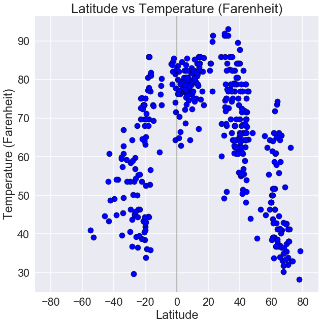

# Weather Analysis

### Observed trend 1: The closer to the equator a city is, the hotter the temperature would be, ranging from 70-95 degrees.

### Observed trend 2: Also around the equarter, humidity tends to be higher because of the hotter temperate.

### Observed trend 3: For cloudiness, there is no correlation based on latitude. Windspeed also seems to average around 5 MPH.


```python
from citipy import citipy
import numpy as np
import pandas as pd
import seaborn as sns
import json
import requests
import matplotlib.pyplot as plt
import random
import os
import csv
import datetime
import time
from config import api_key
from pprint import pprint
```


```python
# Create settings parameters
units = "imperial"
url = "http://api.openweathermap.org/data/2.5/weather?"
```


```python
# Getting a sample that is representative of the world cities.

# Set Lat & Lon Zones to randomly pick coordinates - So, we have some from each region.
lat_zone = np.arange(-90,90,15)
lon_zone = np.arange(-200,200,15)


# Creating a new data frame to hold randomly picked coordinates and corresponding city information
cities_df = pd.DataFrame()

cities_df["Latitude"] = ""
cities_df["Longitude"] = ""

# From each zone, randomly pick 50 unique coordinates and adding to the dataframe.
for x in lat_zone:
    for y in lon_zone:
        x_values = list(np.arange(x,x+15,0.01))
        y_values = list(np.arange(y,y+15,0.01))
        lats = random.sample(x_values,50)
        lons = random.sample(y_values,50)
        lat_samples = [(x+random_lat) for random_lat in lats]
        lon_samples = [y+random_lon for random_lon in lons]
        cities_df = cities_df.append(pd.DataFrame.from_dict({"Latitude":lat_samples,
                                       "Longitude":lon_samples}))
cities_df = cities_df.reset_index(drop=True)
cities_df.head(15)
```


<div>
<style scoped>
    .dataframe tbody tr th:only-of-type {
        vertical-align: middle;
    }

    .dataframe tbody tr th {
        vertical-align: top;
    }

    .dataframe thead th {
        text-align: right;
    }
</style>
<table border="1" class="dataframe">
  <thead>
    <tr style="text-align: right;">
      <th></th>
      <th>Latitude</th>
      <th>Longitude</th>
    </tr>
  </thead>
  <tbody>
    <tr>
      <th>0</th>
      <td>-175.65</td>
      <td>-397.79</td>
    </tr>
    <tr>
      <th>1</th>
      <td>-175.77</td>
      <td>-390.28</td>
    </tr>
    <tr>
      <th>2</th>
      <td>-177.14</td>
      <td>-385.28</td>
    </tr>
    <tr>
      <th>3</th>
      <td>-175.44</td>
      <td>-394.24</td>
    </tr>
    <tr>
      <th>4</th>
      <td>-168.46</td>
      <td>-385.99</td>
    </tr>
    <tr>
      <th>5</th>
      <td>-176.15</td>
      <td>-395.51</td>
    </tr>
    <tr>
      <th>6</th>
      <td>-172.37</td>
      <td>-396.87</td>
    </tr>
    <tr>
      <th>7</th>
      <td>-169.78</td>
      <td>-396.76</td>
    </tr>
    <tr>
      <th>8</th>
      <td>-179.51</td>
      <td>-392.84</td>
    </tr>
    <tr>
      <th>9</th>
      <td>-177.85</td>
      <td>-389.31</td>
    </tr>
    <tr>
      <th>10</th>
      <td>-168.40</td>
      <td>-388.98</td>
    </tr>
    <tr>
      <th>11</th>
      <td>-175.61</td>
      <td>-398.78</td>
    </tr>
    <tr>
      <th>12</th>
      <td>-177.21</td>
      <td>-387.78</td>
    </tr>
    <tr>
      <th>13</th>
      <td>-165.65</td>
      <td>-395.64</td>
    </tr>
    <tr>
      <th>14</th>
      <td>-172.03</td>
      <td>-389.26</td>
    </tr>
  </tbody>
</table>
</div>


```python
# For the selected coordinates, use citipy to associate them with nearest city.

cities_df["Closest City name"] = ""
cities_df["Closest Country code"] = ""
for index,row in cities_df.iterrows():
    city = citipy.nearest_city(row["Latitude"],row["Longitude"])
    cities_df.at[index,"Closest City name"]= city.city_name
    cities_df.at[index,"Closest Country code"] = city.country_code
```


```python
# Dropping random lat and lon samples from dataframe as they are not the exact coordinates for the cities.

clean_cities_df = cities_df.drop(['Latitude', 'Longitude'],axis=1)
clean_cities_df

# Dropping duplicate cities which may have resulted in the previous step
clean_cities_df = clean_cities_df.drop_duplicates()

clean_cities_df.head(15)
```


<div>
<style scoped>
    .dataframe tbody tr th:only-of-type {
        vertical-align: middle;
    }

    .dataframe tbody tr th {
        vertical-align: top;
    }

    .dataframe thead th {
        text-align: right;
    }
</style>
<table border="1" class="dataframe">
  <thead>
    <tr style="text-align: right;">
      <th></th>
      <th>Closest City name</th>
      <th>Closest Country code</th>
    </tr>
  </thead>
  <tbody>
    <tr>
      <th>0</th>
      <td>vaini</td>
      <td>to</td>
    </tr>
    <tr>
      <th>358</th>
      <td>mataura</td>
      <td>pf</td>
    </tr>
    <tr>
      <th>400</th>
      <td>punta arenas</td>
      <td>cl</td>
    </tr>
    <tr>
      <th>404</th>
      <td>ushuaia</td>
      <td>ar</td>
    </tr>
    <tr>
      <th>700</th>
      <td>bredasdorp</td>
      <td>za</td>
    </tr>
    <tr>
      <th>750</th>
      <td>port elizabeth</td>
      <td>za</td>
    </tr>
    <tr>
      <th>756</th>
      <td>port alfred</td>
      <td>za</td>
    </tr>
    <tr>
      <th>800</th>
      <td>albany</td>
      <td>au</td>
    </tr>
    <tr>
      <th>850</th>
      <td>hobart</td>
      <td>au</td>
    </tr>
    <tr>
      <th>900</th>
      <td>bluff</td>
      <td>nz</td>
    </tr>
    <tr>
      <th>1000</th>
      <td>kaitangata</td>
      <td>nz</td>
    </tr>
    <tr>
      <th>1100</th>
      <td>dunedin</td>
      <td>nz</td>
    </tr>
    <tr>
      <th>1152</th>
      <td>waipawa</td>
      <td>nz</td>
    </tr>
    <tr>
      <th>1200</th>
      <td>tolaga bay</td>
      <td>nz</td>
    </tr>
    <tr>
      <th>2000</th>
      <td>hermanus</td>
      <td>za</td>
    </tr>
  </tbody>
</table>
</div>


```python
# Picking a sample of 500 cities to proceed with analysis
selected_cities = clean_cities_df.sample(500)

selected_cities = selected_cities.reset_index(drop=True)
```

## Fetch City Weather Info from OpenWeatherAPI


```python
# Setting up values for OpenWeatherMap API calls
base_url = "http://api.openweathermap.org/data/2.5/weather"
app_id = api_key
params = { "appid" :app_id,"units":"imperial" }
```


```python
query_url = f"{base_url}appid={api_key}&units={units}&q="

counter = 0 + 1

for index,row in selected_cities.iterrows():
    params["q"] =f'{row["Closest City name"]},{row["Closest Country code"]}'
    print(f"Retrieving weather information for city #{counter} | {params['q']}")
    city_weather_resp = requests.get(base_url,params)
    #print(city_weather_resp.url)
    city_weather_resp  = city_weather_resp.json()
    counter = counter + 1   
    selected_cities.set_value(index,"Latitude",city_weather_resp.get("coord",{}).get("lat"))
    selected_cities.set_value(index,"Longitude",city_weather_resp.get("coord",{}).get("lon"))
    selected_cities.set_value(index,"Date",city_weather_resp.get("dt"))
    selected_cities.set_value(index,"Temperature",city_weather_resp.get("main",{}).get("temp_max"))
    selected_cities.set_value(index,"Wind speed",city_weather_resp.get("wind",{}).get("speed"))
    selected_cities.set_value(index,"Humidity",city_weather_resp.get("main",{}).get("humidity"))
    selected_cities.set_value(index,"Cloudiness",city_weather_resp.get("clouds",{}).get("all"))
    
    
```

    Retrieving weather information for city #1 | ewa beach,us
    Retrieving weather information for city #2 | acarau,br
    

    C:\Users\kryst\AppData\Local\Continuum\anaconda3\lib\site-packages\ipykernel_launcher.py:12: FutureWarning: set_value is deprecated and will be removed in a future release. Please use .at[] or .iat[] accessors instead
      if sys.path[0] == '':
    C:\Users\kryst\AppData\Local\Continuum\anaconda3\lib\site-packages\ipykernel_launcher.py:13: FutureWarning: set_value is deprecated and will be removed in a future release. Please use .at[] or .iat[] accessors instead
      del sys.path[0]
    C:\Users\kryst\AppData\Local\Continuum\anaconda3\lib\site-packages\ipykernel_launcher.py:14: FutureWarning: set_value is deprecated and will be removed in a future release. Please use .at[] or .iat[] accessors instead
      
    C:\Users\kryst\AppData\Local\Continuum\anaconda3\lib\site-packages\ipykernel_launcher.py:15: FutureWarning: set_value is deprecated and will be removed in a future release. Please use .at[] or .iat[] accessors instead
      from ipykernel import kernelapp as app
    C:\Users\kryst\AppData\Local\Continuum\anaconda3\lib\site-packages\ipykernel_launcher.py:16: FutureWarning: set_value is deprecated and will be removed in a future release. Please use .at[] or .iat[] accessors instead
      app.launch_new_instance()
    C:\Users\kryst\AppData\Local\Continuum\anaconda3\lib\site-packages\ipykernel_launcher.py:17: FutureWarning: set_value is deprecated and will be removed in a future release. Please use .at[] or .iat[] accessors instead
    C:\Users\kryst\AppData\Local\Continuum\anaconda3\lib\site-packages\ipykernel_launcher.py:18: FutureWarning: set_value is deprecated and will be removed in a future release. Please use .at[] or .iat[] accessors instead
    

    Retrieving weather information for city #3 | xixiang,cn
    Retrieving weather information for city #4 | severo-kurilsk,ru
    Retrieving weather information for city #5 | washington,us
    Retrieving weather information for city #6 | mareeba,au
    Retrieving weather information for city #7 | vila franca do campo,pt
    Retrieving weather information for city #8 | necochea,ar
    Retrieving weather information for city #9 | mitu,co
    Retrieving weather information for city #10 | bejar,es
    Retrieving weather information for city #11 | praia da vitoria,pt
    Retrieving weather information for city #12 | rocha,uy
    Retrieving weather information for city #13 | sur,om
    Retrieving weather information for city #14 | salina cruz,mx
    Retrieving weather information for city #15 | semirom,ir
    Retrieving weather information for city #16 | otradnoye,ru
    Retrieving weather information for city #17 | chegutu,zw
    Retrieving weather information for city #18 | kaduqli,sd
    Retrieving weather information for city #19 | nongan,cn
    Retrieving weather information for city #20 | alexandria,eg
    Retrieving weather information for city #21 | alegrete,br
    Retrieving weather information for city #22 | sanmenxia,cn
    Retrieving weather information for city #23 | san lorenzo,ar
    Retrieving weather information for city #24 | portland,us
    Retrieving weather information for city #25 | warri,ng
    Retrieving weather information for city #26 | nizhniy odes,ru
    Retrieving weather information for city #27 | puerto escondido,mx
    Retrieving weather information for city #28 | tsabong,bw
    Retrieving weather information for city #29 | ocos,gt
    Retrieving weather information for city #30 | pevek,ru
    Retrieving weather information for city #31 | priladozhskiy,ru
    Retrieving weather information for city #32 | punta arenas,cl
    Retrieving weather information for city #33 | chokwe,mz
    Retrieving weather information for city #34 | calama,cl
    Retrieving weather information for city #35 | saint-pierre,pm
    Retrieving weather information for city #36 | conceicao da barra,br
    Retrieving weather information for city #37 | monterey,us
    Retrieving weather information for city #38 | kralendijk,an
    Retrieving weather information for city #39 | nikolskoye,ru
    Retrieving weather information for city #40 | denizli,tr
    Retrieving weather information for city #41 | santa maria,py
    Retrieving weather information for city #42 | ust-tsilma,ru
    Retrieving weather information for city #43 | raudeberg,no
    Retrieving weather information for city #44 | tasbuget,kz
    Retrieving weather information for city #45 | worthington,us
    Retrieving weather information for city #46 | altamont,us
    Retrieving weather information for city #47 | una,br
    Retrieving weather information for city #48 | vestmanna,fo
    Retrieving weather information for city #49 | vavuniya,lk
    Retrieving weather information for city #50 | dixon,us
    Retrieving weather information for city #51 | yellowknife,ca
    Retrieving weather information for city #52 | polikarpion,gr
    Retrieving weather information for city #53 | khonuu,ru
    Retrieving weather information for city #54 | tucuman,ar
    Retrieving weather information for city #55 | enterprise,us
    Retrieving weather information for city #56 | mokena,us
    Retrieving weather information for city #57 | nakasongola,ug
    Retrieving weather information for city #58 | montijo,es
    Retrieving weather information for city #59 | kargasok,ru
    Retrieving weather information for city #60 | roebourne,au
    Retrieving weather information for city #61 | pokhara,np
    Retrieving weather information for city #62 | kerrville,us
    Retrieving weather information for city #63 | yefira,gr
    Retrieving weather information for city #64 | udachnyy,ru
    Retrieving weather information for city #65 | groningen,sr
    Retrieving weather information for city #66 | butaritari,ki
    Retrieving weather information for city #67 | shiloh,us
    Retrieving weather information for city #68 | parakou,bj
    Retrieving weather information for city #69 | talaya,ru
    Retrieving weather information for city #70 | barkly west,za
    Retrieving weather information for city #71 | excelsior springs,us
    Retrieving weather information for city #72 | port hedland,au
    Retrieving weather information for city #73 | naryan-mar,ru
    Retrieving weather information for city #74 | namatanai,pg
    Retrieving weather information for city #75 | vardo,no
    Retrieving weather information for city #76 | ferkessedougou,ci
    Retrieving weather information for city #77 | stornoway,gb
    Retrieving weather information for city #78 | moree,au
    Retrieving weather information for city #79 | mamallapuram,in
    Retrieving weather information for city #80 | piacabucu,br
    Retrieving weather information for city #81 | kolokani,ml
    Retrieving weather information for city #82 | kavieng,pg
    Retrieving weather information for city #83 | tema,gh
    Retrieving weather information for city #84 | keningau,my
    Retrieving weather information for city #85 | saint george,bm
    Retrieving weather information for city #86 | kaya,bf
    Retrieving weather information for city #87 | lompoc,us
    Retrieving weather information for city #88 | verin,es
    Retrieving weather information for city #89 | la asuncion,ve
    Retrieving weather information for city #90 | kuytun,cn
    Retrieving weather information for city #91 | ames,us
    Retrieving weather information for city #92 | mirandela,pt
    Retrieving weather information for city #93 | yunyang,cn
    Retrieving weather information for city #94 | ylivieska,fi
    Retrieving weather information for city #95 | ust-nera,ru
    Retrieving weather information for city #96 | quatre cocos,mu
    Retrieving weather information for city #97 | mikkeli,fi
    Retrieving weather information for city #98 | ejea de los caballeros,es
    Retrieving weather information for city #99 | miri,my
    Retrieving weather information for city #100 | pengcheng,cn
    Retrieving weather information for city #101 | saskylakh,ru
    Retrieving weather information for city #102 | tarbes,fr
    Retrieving weather information for city #103 | juba,sd
    Retrieving weather information for city #104 | bairiki,ki
    Retrieving weather information for city #105 | boyabat,tr
    Retrieving weather information for city #106 | yamada,jp
    Retrieving weather information for city #107 | osmena,ph
    Retrieving weather information for city #108 | choma,zm
    Retrieving weather information for city #109 | beyneu,kz
    Retrieving weather information for city #110 | cabo san lucas,mx
    Retrieving weather information for city #111 | letlhakane,bw
    Retrieving weather information for city #112 | umm kaddadah,sd
    Retrieving weather information for city #113 | santiago del estero,ar
    Retrieving weather information for city #114 | boa vista,br
    Retrieving weather information for city #115 | kem,ru
    Retrieving weather information for city #116 | lorengau,pg
    Retrieving weather information for city #117 | moerai,pf
    Retrieving weather information for city #118 | sindor,ru
    Retrieving weather information for city #119 | oistins,bb
    Retrieving weather information for city #120 | charters towers,au
    Retrieving weather information for city #121 | illoqqortoormiut,gl
    Retrieving weather information for city #122 | sumen,bg
    Retrieving weather information for city #123 | xiaoshi,cn
    Retrieving weather information for city #124 | teya,ru
    Retrieving weather information for city #125 | villanueva de cordoba,es
    Retrieving weather information for city #126 | itaugua,py
    Retrieving weather information for city #127 | saint-pierre,re
    Retrieving weather information for city #128 | huaiyin,cn
    Retrieving weather information for city #129 | vogan,tg
    Retrieving weather information for city #130 | aitape,pg
    Retrieving weather information for city #131 | acajutla,sv
    Retrieving weather information for city #132 | mabaruma,gy
    Retrieving weather information for city #133 | wuan,cn
    Retrieving weather information for city #134 | rovaniemi,fi
    Retrieving weather information for city #135 | muyezerskiy,ru
    Retrieving weather information for city #136 | tumannyy,ru
    Retrieving weather information for city #137 | shunyi,cn
    Retrieving weather information for city #138 | sopelana,es
    Retrieving weather information for city #139 | champerico,gt
    Retrieving weather information for city #140 | upernavik,gl
    Retrieving weather information for city #141 | lebu,cl
    Retrieving weather information for city #142 | villarrobledo,es
    Retrieving weather information for city #143 | saint-leu,re
    Retrieving weather information for city #144 | talnakh,ru
    Retrieving weather information for city #145 | norman wells,ca
    Retrieving weather information for city #146 | paralimni,cy
    Retrieving weather information for city #147 | teahupoo,pf
    Retrieving weather information for city #148 | tuburan,ph
    Retrieving weather information for city #149 | fairbanks,us
    Retrieving weather information for city #150 | north bend,us
    Retrieving weather information for city #151 | woodway,us
    Retrieving weather information for city #152 | galgani,sd
    Retrieving weather information for city #153 | wamba,cd
    Retrieving weather information for city #154 | kishi,ng
    Retrieving weather information for city #155 | maniitsoq,gl
    Retrieving weather information for city #156 | beira,mz
    Retrieving weather information for city #157 | rundu,na
    Retrieving weather information for city #158 | saint-denis,re
    Retrieving weather information for city #159 | morro bay,us
    Retrieving weather information for city #160 | carutapera,br
    Retrieving weather information for city #161 | mrirt,ma
    Retrieving weather information for city #162 | tagusao,ph
    Retrieving weather information for city #163 | vammala,fi
    Retrieving weather information for city #164 | sarakhs,ir
    Retrieving weather information for city #165 | airai,pw
    Retrieving weather information for city #166 | utrecht,za
    Retrieving weather information for city #167 | lawton,us
    Retrieving weather information for city #168 | arkhangelos,gr
    Retrieving weather information for city #169 | danville,us
    Retrieving weather information for city #170 | uyuni,bo
    Retrieving weather information for city #171 | catamarca,ar
    Retrieving weather information for city #172 | caravelas,br
    Retrieving weather information for city #173 | lasa,cn
    Retrieving weather information for city #174 | ardistan,ir
    Retrieving weather information for city #175 | pechenga,ru
    Retrieving weather information for city #176 | nokaneng,bw
    Retrieving weather information for city #177 | marsa matruh,eg
    Retrieving weather information for city #178 | chernyshevskiy,ru
    Retrieving weather information for city #179 | sabang,id
    Retrieving weather information for city #180 | ushuaia,ar
    Retrieving weather information for city #181 | rawson,ar
    Retrieving weather information for city #182 | turukhansk,ru
    Retrieving weather information for city #183 | matara,lk
    Retrieving weather information for city #184 | saint-joseph,re
    Retrieving weather information for city #185 | tabou,ci
    Retrieving weather information for city #186 | bolungarvik,is
    Retrieving weather information for city #187 | jieshou,cn
    Retrieving weather information for city #188 | yarmouth,ca
    Retrieving weather information for city #189 | chifeng,cn
    Retrieving weather information for city #190 | roquetas de mar,es
    Retrieving weather information for city #191 | harwich,us
    Retrieving weather information for city #192 | atuona,pf
    Retrieving weather information for city #193 | lydenburg,za
    Retrieving weather information for city #194 | thinadhoo,mv
    Retrieving weather information for city #195 | la rioja,ar
    Retrieving weather information for city #196 | cape elizabeth,us
    Retrieving weather information for city #197 | nouna,bf
    Retrieving weather information for city #198 | bara,sd
    Retrieving weather information for city #199 | kegayli,uz
    Retrieving weather information for city #200 | kigorobya,ug
    Retrieving weather information for city #201 | phan rang,vn
    Retrieving weather information for city #202 | yulara,au
    Retrieving weather information for city #203 | jantianon,ph
    Retrieving weather information for city #204 | myaundzha,ru
    Retrieving weather information for city #205 | antalaha,mg
    Retrieving weather information for city #206 | huilong,cn
    Retrieving weather information for city #207 | lerwick,gb
    Retrieving weather information for city #208 | punaauia,pf
    Retrieving weather information for city #209 | teguldet,ru
    Retrieving weather information for city #210 | odienne,ci
    Retrieving weather information for city #211 | sibu,my
    Retrieving weather information for city #212 | fortuna,us
    Retrieving weather information for city #213 | skala,gr
    Retrieving weather information for city #214 | egvekinot,ru
    Retrieving weather information for city #215 | suntar,ru
    Retrieving weather information for city #216 | bereda,so
    Retrieving weather information for city #217 | kahului,us
    Retrieving weather information for city #218 | hohhot,cn
    Retrieving weather information for city #219 | belushya guba,ru
    Retrieving weather information for city #220 | ayame,ci
    Retrieving weather information for city #221 | upington,za
    Retrieving weather information for city #222 | warqla,dz
    Retrieving weather information for city #223 | bonfim,br
    Retrieving weather information for city #224 | mount isa,au
    Retrieving weather information for city #225 | plettenberg bay,za
    Retrieving weather information for city #226 | broome,au
    Retrieving weather information for city #227 | barcelona,ve
    Retrieving weather information for city #228 | baker city,us
    Retrieving weather information for city #229 | shelburne,ca
    Retrieving weather information for city #230 | saraj,mk
    Retrieving weather information for city #231 | huanren,cn
    Retrieving weather information for city #232 | sorland,no
    Retrieving weather information for city #233 | longyearbyen,sj
    Retrieving weather information for city #234 | santa barbara,bo
    Retrieving weather information for city #235 | antofagasta,cl
    Retrieving weather information for city #236 | beringovskiy,ru
    Retrieving weather information for city #237 | mehriz,ir
    Retrieving weather information for city #238 | yanan,cn
    Retrieving weather information for city #239 | komsomolskiy,ru
    Retrieving weather information for city #240 | sabzevar,ir
    Retrieving weather information for city #241 | magnolia,us
    Retrieving weather information for city #242 | redcliffe,zw
    Retrieving weather information for city #243 | presidencia roque saenz pena,ar
    Retrieving weather information for city #244 | kapit,my
    Retrieving weather information for city #245 | kodiak,us
    Retrieving weather information for city #246 | tieling,cn
    Retrieving weather information for city #247 | liverpool,ca
    Retrieving weather information for city #248 | vanimo,pg
    Retrieving weather information for city #249 | luancheng,cn
    Retrieving weather information for city #250 | healdsburg,us
    Retrieving weather information for city #251 | klaksvik,fo
    Retrieving weather information for city #252 | baraboo,us
    Retrieving weather information for city #253 | meulaboh,id
    Retrieving weather information for city #254 | harper,lr
    Retrieving weather information for city #255 | rudbar,af
    Retrieving weather information for city #256 | tarakan,id
    Retrieving weather information for city #257 | skalistyy,ru
    Retrieving weather information for city #258 | sorvag,fo
    Retrieving weather information for city #259 | suez,eg
    Retrieving weather information for city #260 | hambantota,lk
    Retrieving weather information for city #261 | lagoa,pt
    Retrieving weather information for city #262 | sentyabrskiy,ru
    Retrieving weather information for city #263 | shurugwi,zw
    Retrieving weather information for city #264 | nuevo progreso,gt
    Retrieving weather information for city #265 | vuktyl,ru
    Retrieving weather information for city #266 | muhos,fi
    Retrieving weather information for city #267 | baykit,ru
    Retrieving weather information for city #268 | nata,bw
    Retrieving weather information for city #269 | sehithwa,bw
    Retrieving weather information for city #270 | daphne,us
    Retrieving weather information for city #271 | copiapo,cl
    Retrieving weather information for city #272 | neiafu,to
    Retrieving weather information for city #273 | axim,gh
    Retrieving weather information for city #274 | gweta,bw
    Retrieving weather information for city #275 | montpellier,fr
    Retrieving weather information for city #276 | clyde river,ca
    Retrieving weather information for city #277 | revda,ru
    Retrieving weather information for city #278 | port elizabeth,za
    Retrieving weather information for city #279 | simbahan,ph
    Retrieving weather information for city #280 | sisimiut,gl
    Retrieving weather information for city #281 | borovoy,ru
    Retrieving weather information for city #282 | anloga,gh
    Retrieving weather information for city #283 | sri aman,my
    Retrieving weather information for city #284 | seymchan,ru
    Retrieving weather information for city #285 | kadykchan,ru
    Retrieving weather information for city #286 | copperas cove,us
    Retrieving weather information for city #287 | qui nhon,vn
    Retrieving weather information for city #288 | claremore,us
    Retrieving weather information for city #289 | yeppoon,au
    Retrieving weather information for city #290 | vaasa,fi
    Retrieving weather information for city #291 | magdalena,ph
    Retrieving weather information for city #292 | waipawa,nz
    Retrieving weather information for city #293 | inverell,au
    Retrieving weather information for city #294 | dos hermanas,es
    Retrieving weather information for city #295 | comodoro rivadavia,ar
    Retrieving weather information for city #296 | damietta,eg
    Retrieving weather information for city #297 | shihezi,cn
    Retrieving weather information for city #298 | arraial do cabo,br
    Retrieving weather information for city #299 | gambela,et
    Retrieving weather information for city #300 | tiksi,ru
    Retrieving weather information for city #301 | tornio,fi
    Retrieving weather information for city #302 | karratha,au
    Retrieving weather information for city #303 | lensk,ru
    Retrieving weather information for city #304 | ahuimanu,us
    Retrieving weather information for city #305 | isangel,vu
    Retrieving weather information for city #306 | tsihombe,mg
    Retrieving weather information for city #307 | limbang,my
    Retrieving weather information for city #308 | byron bay,au
    Retrieving weather information for city #309 | pafos,cy
    Retrieving weather information for city #310 | neyshabur,ir
    Retrieving weather information for city #311 | pacific grove,us
    Retrieving weather information for city #312 | tipitapa,ni
    Retrieving weather information for city #313 | sao joao da barra,br
    Retrieving weather information for city #314 | chlorakas,cy
    Retrieving weather information for city #315 | kavakli,tr
    Retrieving weather information for city #316 | azimur,ma
    Retrieving weather information for city #317 | eureka,us
    Retrieving weather information for city #318 | tarudant,ma
    Retrieving weather information for city #319 | lisala,cd
    Retrieving weather information for city #320 | esperance,au
    Retrieving weather information for city #321 | albany,au
    Retrieving weather information for city #322 | svetlogorsk,ru
    Retrieving weather information for city #323 | san cristobal,ec
    Retrieving weather information for city #324 | yichang,cn
    Retrieving weather information for city #325 | qaanaaq,gl
    Retrieving weather information for city #326 | zharkent,kz
    Retrieving weather information for city #327 | cheremukhovo,ru
    Retrieving weather information for city #328 | onda,es
    Retrieving weather information for city #329 | upata,ve
    Retrieving weather information for city #330 | kouango,cf
    Retrieving weather information for city #331 | tengzhou,cn
    Retrieving weather information for city #332 | ambodifototra,mg
    Retrieving weather information for city #333 | brae,gb
    Retrieving weather information for city #334 | gorontalo,id
    Retrieving weather information for city #335 | diebougou,bf
    Retrieving weather information for city #336 | kruisfontein,za
    Retrieving weather information for city #337 | hay river,ca
    Retrieving weather information for city #338 | castro,cl
    Retrieving weather information for city #339 | along,in
    Retrieving weather information for city #340 | kudat,my
    Retrieving weather information for city #341 | benavente,es
    Retrieving weather information for city #342 | elko,us
    Retrieving weather information for city #343 | toamasina,mg
    Retrieving weather information for city #344 | hobart,au
    Retrieving weather information for city #345 | ugoofaaru,mv
    Retrieving weather information for city #346 | yhu,py
    Retrieving weather information for city #347 | siocon,ph
    Retrieving weather information for city #348 | meridian,us
    Retrieving weather information for city #349 | chokurdakh,ru
    Retrieving weather information for city #350 | balkanabat,tm
    Retrieving weather information for city #351 | norman,us
    Retrieving weather information for city #352 | abu jubayhah,sd
    Retrieving weather information for city #353 | bredasdorp,za
    Retrieving weather information for city #354 | tawnat,ma
    Retrieving weather information for city #355 | bosilegrad,rs
    Retrieving weather information for city #356 | belaya gora,ru
    Retrieving weather information for city #357 | burdur,tr
    Retrieving weather information for city #358 | evansville,us
    Retrieving weather information for city #359 | brandon,us
    Retrieving weather information for city #360 | okitipupa,ng
    Retrieving weather information for city #361 | libertador general san martin,ar
    Retrieving weather information for city #362 | puerto baquerizo moreno,ec
    Retrieving weather information for city #363 | buluang,ph
    Retrieving weather information for city #364 | dharchula,in
    Retrieving weather information for city #365 | talawdi,sd
    Retrieving weather information for city #366 | tukrah,ly
    Retrieving weather information for city #367 | promyshlennyy,ru
    Retrieving weather information for city #368 | cove,bj
    Retrieving weather information for city #369 | bethel,us
    Retrieving weather information for city #370 | brokopondo,sr
    Retrieving weather information for city #371 | tevaitoa,pf
    Retrieving weather information for city #372 | kamiiso,jp
    Retrieving weather information for city #373 | hualmay,pe
    Retrieving weather information for city #374 | roma,au
    Retrieving weather information for city #375 | marseille,fr
    Retrieving weather information for city #376 | vaitupu,wf
    Retrieving weather information for city #377 | melilla,es
    Retrieving weather information for city #378 | natchitoches,us
    Retrieving weather information for city #379 | tautira,pf
    Retrieving weather information for city #380 | mountain home,us
    Retrieving weather information for city #381 | bandarbeyla,so
    Retrieving weather information for city #382 | katsuura,jp
    Retrieving weather information for city #383 | mataura,pf
    Retrieving weather information for city #384 | totness,sr
    Retrieving weather information for city #385 | aflu,dz
    Retrieving weather information for city #386 | kayerkan,ru
    Retrieving weather information for city #387 | vaitape,pf
    Retrieving weather information for city #388 | zapolyarnyy,ru
    Retrieving weather information for city #389 | anqing,cn
    Retrieving weather information for city #390 | west memphis,us
    Retrieving weather information for city #391 | berlevag,no
    Retrieving weather information for city #392 | dikson,ru
    Retrieving weather information for city #393 | koforidua,gh
    Retrieving weather information for city #394 | birao,cf
    Retrieving weather information for city #395 | obo,cf
    Retrieving weather information for city #396 | usinsk,ru
    Retrieving weather information for city #397 | porto novo,cv
    Retrieving weather information for city #398 | ouargaye,bf
    Retrieving weather information for city #399 | le port,re
    Retrieving weather information for city #400 | bargal,so
    Retrieving weather information for city #401 | zhanaozen,kz
    Retrieving weather information for city #402 | kamaishi,jp
    Retrieving weather information for city #403 | kautokeino,no
    Retrieving weather information for city #404 | ler,sd
    Retrieving weather information for city #405 | tabialan,ph
    Retrieving weather information for city #406 | hami,cn
    Retrieving weather information for city #407 | santa eulalia del rio,es
    Retrieving weather information for city #408 | ponta delgada,pt
    Retrieving weather information for city #409 | faanui,pf
    Retrieving weather information for city #410 | fort wellington,gy
    Retrieving weather information for city #411 | santander,es
    Retrieving weather information for city #412 | yumen,cn
    Retrieving weather information for city #413 | santa cruz,cr
    Retrieving weather information for city #414 | siparia,tt
    Retrieving weather information for city #415 | southbridge,nz
    Retrieving weather information for city #416 | nikolskiy,ru
    Retrieving weather information for city #417 | raga,sd
    Retrieving weather information for city #418 | san jose,gt
    Retrieving weather information for city #419 | nyurba,ru
    Retrieving weather information for city #420 | port hueneme,us
    Retrieving weather information for city #421 | kavaratti,in
    Retrieving weather information for city #422 | marabba,sd
    Retrieving weather information for city #423 | cotonou,bj
    Retrieving weather information for city #424 | sosnogorsk,ru
    Retrieving weather information for city #425 | almansa,es
    Retrieving weather information for city #426 | warwick,au
    Retrieving weather information for city #427 | chalus,ir
    Retrieving weather information for city #428 | kattivakkam,in
    Retrieving weather information for city #429 | bengkulu,id
    Retrieving weather information for city #430 | caldwell,us
    Retrieving weather information for city #431 | chimore,bo
    Retrieving weather information for city #432 | kalayaan,ph
    Retrieving weather information for city #433 | grand gaube,mu
    Retrieving weather information for city #434 | hithadhoo,mv
    Retrieving weather information for city #435 | torit,sd
    Retrieving weather information for city #436 | abilene,us
    Retrieving weather information for city #437 | king city,us
    Retrieving weather information for city #438 | coruripe,br
    Retrieving weather information for city #439 | san vicente,ph
    Retrieving weather information for city #440 | bartica,gy
    Retrieving weather information for city #441 | narsaq,gl
    Retrieving weather information for city #442 | lakota,ci
    Retrieving weather information for city #443 | san juan nepomuceno,py
    Retrieving weather information for city #444 | tera,ne
    Retrieving weather information for city #445 | kysyl-syr,ru
    Retrieving weather information for city #446 | diego de almagro,cl
    Retrieving weather information for city #447 | northam,au
    Retrieving weather information for city #448 | avera,pf
    Retrieving weather information for city #449 | moroto,ug
    Retrieving weather information for city #450 | tabiauea,ki
    Retrieving weather information for city #451 | moranbah,au
    Retrieving weather information for city #452 | muzhi,ru
    Retrieving weather information for city #453 | russell,nz
    Retrieving weather information for city #454 | two rivers,us
    Retrieving weather information for city #455 | palapye,bw
    Retrieving weather information for city #456 | bathsheba,bb
    Retrieving weather information for city #457 | sinazongwe,zm
    Retrieving weather information for city #458 | itarema,br
    Retrieving weather information for city #459 | tirumullaivasal,in
    Retrieving weather information for city #460 | gayny,ru
    Retrieving weather information for city #461 | maceio,br
    Retrieving weather information for city #462 | linhares,br
    Retrieving weather information for city #463 | port-gentil,ga
    Retrieving weather information for city #464 | dandong,cn
    Retrieving weather information for city #465 | ylojarvi,fi
    Retrieving weather information for city #466 | palmer,us
    Retrieving weather information for city #467 | ahipara,nz
    Retrieving weather information for city #468 | urumqi,cn
    Retrieving weather information for city #469 | akita,jp
    Retrieving weather information for city #470 | luderitz,na
    Retrieving weather information for city #471 | zhucheng,cn
    Retrieving weather information for city #472 | kisangani,cd
    Retrieving weather information for city #473 | bend,us
    Retrieving weather information for city #474 | sapa,ph
    Retrieving weather information for city #475 | yirol,sd
    Retrieving weather information for city #476 | bojnurd,ir
    Retrieving weather information for city #477 | barra do bugres,br
    Retrieving weather information for city #478 | sao filipe,cv
    Retrieving weather information for city #479 | litokhoron,gr
    Retrieving weather information for city #480 | lahad datu,my
    Retrieving weather information for city #481 | mehamn,no
    Retrieving weather information for city #482 | banda aceh,id
    Retrieving weather information for city #483 | mayor pablo lagerenza,py
    Retrieving weather information for city #484 | mananjary,mg
    Retrieving weather information for city #485 | kalmunai,lk
    Retrieving weather information for city #486 | hannibal,us
    Retrieving weather information for city #487 | broken hill,au
    Retrieving weather information for city #488 | gazojak,tm
    Retrieving weather information for city #489 | maun,bw
    Retrieving weather information for city #490 | saint-paul,re
    Retrieving weather information for city #491 | datong,cn
    Retrieving weather information for city #492 | satao,pt
    Retrieving weather information for city #493 | rikitea,pf
    Retrieving weather information for city #494 | olafsvik,is
    Retrieving weather information for city #495 | khudumelapye,bw
    Retrieving weather information for city #496 | floro,no
    Retrieving weather information for city #497 | tolaga bay,nz
    Retrieving weather information for city #498 | kjollefjord,no
    Retrieving weather information for city #499 | hobyo,so
    Retrieving weather information for city #500 | barcelos,br
    


```python
# Drop cities with missing information
selected_cities = selected_cities.dropna()

selected_cities.to_csv("500 City_Weather_data.csv")
```

## Weather Plots


```python
# Plot settings
def set_plot(x_title,x_lim,y_title):
    plt.title(f"{x_title} vs {y_title}")
    plt.ylabel(y_title)
    plt.xlabel(x_title)
    plt.grid(True)
    plt.xlim(x_lim)
    sns.set(style="darkgrid", rc={"figure.figsize": (10, 10)})
    sns.set_context("talk", font_scale=1.35)
```

### 1. Latitude vs Temperature Plot


```python
plt.scatter(selected_cities["Latitude"], selected_cities["Temperature"], marker="o", color="b", edgecolor="black")
set_plot("Latitude",[-90,90],"Temperature (Farenheit)")
plt.axvline(0, color='black',alpha=0.25)
plt.savefig("Latitude vs Temperature Plot.png")
plt.show()
```





### 2. Latitude vs Humidity plot


```python
plt.scatter(selected_cities["Latitude"], selected_cities["Humidity"], marker="o", color="y", edgecolor="black")
set_plot("Latitude",[-90,90],"Humidity")
plt.axvline(0, color='black',alpha=0.25)
plt.savefig("Latitude vs Humidity Plot.png")
plt.show()
```


### 3. Latitude vs Cloudiness plot


```python
plt.scatter(selected_cities["Latitude"], selected_cities["Cloudiness"], marker="o", color="coral", edgecolor="black")
set_plot("Latitude",[-90,90],"Cloudiness")
plt.axvline(0, color='black',alpha=0.25)
plt.savefig("Latitude vs Cloudiness Plot.png")
plt.show()
```


### 4. Latitude vs Wind Speed plot


```python
plt.scatter(selected_cities["Latitude"], selected_cities["Wind speed"], marker="o", color="r", edgecolor="black")
set_plot("Latitude",[-90,90],"Wind Speed")
plt.axvline(0, color='black',alpha=0.25)
plt.savefig("Latitude vs Wind Speed Plot.png")
plt.show()
```


